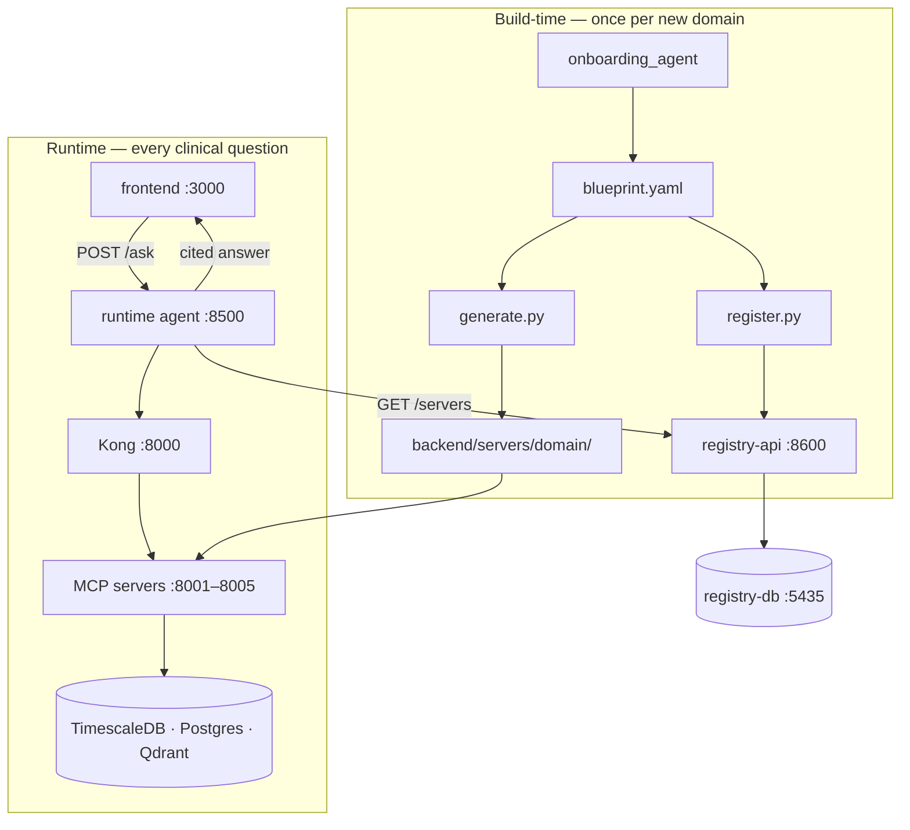

# MCP-Data-Factory

**Patient Risk Intelligence MCP Platform** — an agentic [Model Context Protocol](https://modelcontextprotocol.io)
layer that gives clinicians a live, explainable, multi-domain risk picture of a patient,
fused from independently governed data domains.

Built from free, self-hosted, open-source components and fed by fully synthetic FHIR R4
patient data ([Synthea](https://github.com/synthetichealth/synthea)) — zero real PHI.

---

## Directory Structure

```
MCP-Data-Factory/
│
├── docker-compose.yml                 # unified stack — data + platform (+ optional profiles)
├── docker-compose.data.yml            # data stores only (legacy partial run)
├── docker-compose.platform.yml        # gateway / identity / registry only (legacy partial run)
├── pytest.ini
├── requirements.txt / requirements.lock
├── .env.example                       # copy to .env (gitignored)
│
├── scripts/
│   ├── start_mcp_servers.sh           # start MCP servers on :8001–8004; --verify runs checks
│   ├── pre_push_verify.py             # live health + RBAC + tool-call acceptance
│   └── mcp_inspector_smoke.py          # tools/list smoke (live or --in-process)
│
├── infra/                             # infrastructure config + data loading
│   ├── postgres/
│   │   ├── init-timescale-vitals.sql
│   │   ├── init-labs-diagnoses.sql
│   │   ├── init-medications.sql
│   │   ├── init-registry-db.sql       # 12-table control-plane schema
│   │   ├── init-radiology.sql
│   │   └── seed-interaction-rules.sql
│   ├── keycloak/
│   │   └── realm-export.json          # patient-risk realm, 3 roles, OAuth clients
│   ├── kong/
│   │   └── kong.yml                   # MCP routes, JWT, rate limits
│   └── synthea/
│       ├── load_patients.py           # generate + load SQL + optional Qdrant notes
│       └── demo_patient_aliases.json  # demo-patient-1 … demo-patient-31 → UUID
│
├── backend/
│   ├── shared/                        # Fixed Core — imported by every MCP server
│   │   ├── connector_base.py          # Connector ABC
│   │   ├── auth.py                    # Layer-2 JWT + scope/group RBAC
│   │   ├── middleware.py              # FixedCoreGuard ASGI wrapper
│   │   ├── audit.py                   # structured audit + purpose_of_access enum
│   │   ├── egress_guard.py            # locked_connector_for (SSRF guard)
│   │   ├── cache.py                   # 30s TTL read cache
│   │   ├── self_healing.py            # tenacity retry on transient DB errors
│   │   ├── telemetry.py               # OpenTelemetry → Jaeger
│   │   ├── tool_trust.py              # Kong-origin + tool-poisoning guard
│   │   ├── usage_log.py               # per-role counters → /usage
│   │   └── embeddings.py              # single-source embedding model for Qdrant
│   │
│   ├── connectors/
│   │   ├── sql_connector.py           # TimescaleDB / Postgres (asyncpg, read-only)
│   │   └── vector_connector.py        # Qdrant semantic search
│   │
│   ├── servers/                       # MCP servers — one package per clinical domain
│   │   ├── vitals_trends/             # :8001  mcp.vitals.read
│   │   ├── labs_diagnoses/            # :8002  mcp.labs.read
│   │   ├── medications_interactions/  # :8003  mcp.meds.read
│   │   ├── clinical_notes_search/     # :8004  mcp.notes.read  (Qdrant)
│   │   └── radiology_reports/         # :8005  mcp.radiology.read  (factory demo)
│   │
│   ├── onboarding_agent/              # build-time — discover → blueprint → generate → register
│   │   ├── discover.py
│   │   ├── suggest_tools.py
│   │   ├── draft_rbac.py
│   │   ├── assemble_blueprint.py
│   │   ├── main.py                    # interactive approval CLI
│   │   ├── run.py                     # non-interactive pipeline
│   │   ├── generate.py                # blueprint → backend/servers/<domain>/
│   │   ├── register.py                # blueprint → registry-api POST /servers
│   │   └── output/                    # approved blueprint artifacts
│   │
│   ├── registry/                      # control-plane API
│   │   ├── main.py                    # GET /servers, GET /audit, POST /servers
│   │   ├── auth.py
│   │   └── models.py
│   │
│   ├── tests/                         # pytest suite (RBAC matrix, Fixed Core, smoke)
│   └── README.md
│
├── agent/                             # runtime LangGraph MCP host
│   ├── runtime_agent.py               # POST /ask — fuses multi-domain answers
│   ├── prompts.py
│   ├── Dockerfile
│   └── README.md
│
├── frontend/                          # pending — Next.js + CopilotKit + NextAuth
│
├── docs/                              # living documentation (see index below)
└── PRD Docs/                          # original PDF requirements
```

### Top-level folders

| Path | Role |
| --- | --- |
| `infra/` | Docker init SQL, Kong/Keycloak config, Synthea loader |
| `backend/shared/` | Fixed Core security + observability modules |
| `backend/connectors/` | SQL and vector data access (same `Connector` interface) |
| `backend/servers/` | Domain MCP servers (`main.py`, `tools.py`, `blueprint.yaml`) |
| `backend/onboarding_agent/` | Build-time factory: schema → blueprint → server → registry |
| `backend/registry/` | Control-plane API backed by `registry-db` |
| `agent/` | Runtime agent — calls MCP servers, synthesizes cited clinical answers |
| `frontend/` | Clinician UI — chat, dashboard, anomaly panel *(not built yet)* |
| `scripts/` | Start servers, smoke tests, pre-push verification |

---

## Quick Start

> Full setup guide: [`docs/IMPLEMENTATION.md`](docs/IMPLEMENTATION.md)

```bash
git clone https://github.com/aakash-p-s/MCP-Data-Factory.git
cd MCP-Data-Factory
git checkout main                        # or person-a/phase-2 — same codebase
cp .env.example .env                     # fill passwords + OPENAI_API_KEY

uv venv --python 3.12
uv pip install -r requirements.txt

# Start data stores + platform (Keycloak, Kong, registry, Jaeger)
docker compose up -d

# Seed synthetic patients (first time)
curl -sL -o infra/synthea/synthea-with-dependencies.jar \
  https://github.com/synthetichealth/synthea/releases/download/v4.0.0/synthea-with-dependencies.jar
set -a && source .env && set +a
uv run python infra/synthea/load_patients.py
LOAD_NOTES=true uv run python infra/synthea/load_patients.py   # Qdrant notes for :8004

# Start all MCP servers (host-run, :8001–8004)
bash scripts/start_mcp_servers.sh

# Runtime agent (optional)
uv pip install -r agent/requirements.txt
uv run uvicorn agent.runtime_agent:app --host 0.0.0.0 --port 8500

# Register servers + enable discovery (optional — for dynamic domains)
uv run python -m backend.onboarding_agent.register --all
# set REGISTRY_DISCOVERY=true in .env
```

**Verify:**

```bash
uv run pytest backend/tests/ -q                    # unit + RBAC tests
bash scripts/start_mcp_servers.sh --verify         # live health + tool calls
uv run python scripts/mcp_inspector_smoke.py      # tools/list on :8001–8004
```

---

## Architecture



Detail: [`docs/ONBOARDING_RUNTIME_BRIDGE.md`](docs/ONBOARDING_RUNTIME_BRIDGE.md) ·
[`docs/INFRASTRUCTURE.md`](docs/INFRASTRUCTURE.md)

### RBAC matrix

| Role | vitals | labs | meds | notes |
| --- | :---: | :---: | :---: | :---: |
| clinical-viewer | Allow | Allow | Deny | Deny |
| physician | Allow | Allow | Allow | Allow |
| case-manager | Deny | Deny | Deny | Allow |

Two security layers: **Kong** (Layer 1 — valid token, rate limit, route) and each **MCP server**
(Layer 2 — re-verify JWT, check `scp` + `groups[]` per tool).

---

## MCP Servers

| Server | Port | Scope | Kong route |
| --- | --- | --- | --- |
| `vitals_trends` | 8001 | `mcp.vitals.read` | `/mcp/clinical/vitals-trends/dev` |
| `labs_diagnoses` | 8002 | `mcp.labs.read` | `/mcp/clinical/labs-diagnoses/dev` |
| `medications_interactions` | 8003 | `mcp.meds.read` | `/mcp/clinical/medications-interactions/dev` |
| `clinical_notes_search` | 8004 | `mcp.notes.read` | `/mcp/clinical/clinical-notes-search/dev` |
| `radiology_reports` | 8005 | `mcp.radiology.read` | `/mcp/clinical/radiology-reports/dev` *(Kong manual)* |

Each server exposes `/health`, `/usage`, and `/mcp` (Streamable HTTP). Demo patient:
`demo-patient-1` → `080b069b-5108-46b6-ecef-6aacd3b9ef3f` (see `demo_patient_aliases.json`).
The runtime agent resolves aliases automatically.

---

## Ports & URLs

| Service | Port | URL |
| --- | --- | --- |
| Frontend | 3000 | http://localhost:3000 *(pending)* |
| Runtime agent | 8500 | http://localhost:8500/ask |
| Kong proxy | 8000 | http://localhost:8000 |
| Kong admin | 8101 | http://localhost:8101 |
| Keycloak | 8080 | http://localhost:8080 |
| Registry API | 8600 | http://localhost:8600/docs |
| Jaeger | 16686 | http://localhost:16686 |
| MCP servers | 8001–8005 | http://localhost:800x/health |
| TimescaleDB | 5433 | localhost:5433 |
| Postgres (clinical) | 5434 | localhost:5434 |
| Registry DB | 5435 | localhost:5435 |
| Qdrant | 6333 | http://localhost:6333/dashboard |
| pgAdmin (optional) | 5050 | http://localhost:5050 |

---

## Project Status

| Area | Status |
| --- | --- |
| Data stores + Synthea loader | Done |
| 4 core MCP servers (:8001–8004, 12 tools) | Done |
| Fixed Core (auth, audit, egress, cache, self-healing) | Done |
| Kong + Keycloak + registry-db + registry-api + Jaeger | Done |
| Onboarding agent (CLI + factory bridge) | Done |
| Runtime agent (`POST /ask`, registry discovery) | Done |
| `radiology_reports` demo domain (:8005) | Done (generated scaffold) |
| Frontend (chat + dashboard + anomaly panel) | **Pending** |
| Kong auto-provisioning for new domains | Manual (`kong.yml` edit) |

**Tests:** 77+ pytest · MCP Inspector 4/4 · pre-push verify 14/14

---

## Documentation

| Doc | Contents |
| --- | --- |
| [`docs/IMPLEMENTATION.md`](docs/IMPLEMENTATION.md) | Clone-to-running setup (any OS) |
| [`docs/MCP_SERVERS.md`](docs/MCP_SERVERS.md) | How each MCP server is built |
| [`docs/INFRASTRUCTURE.md`](docs/INFRASTRUCTURE.md) | Docker services, Kong, Keycloak |
| [`docs/ONBOARDING_AGENT.md`](docs/ONBOARDING_AGENT.md) | Build-time onboarding pipeline |
| [`docs/ONBOARDING_RUNTIME_BRIDGE.md`](docs/ONBOARDING_RUNTIME_BRIDGE.md) | generate → register → discover |
| [`docs/PERSON_B_FRONTEND.md`](docs/PERSON_B_FRONTEND.md) | Frontend build spec (pending) |
| [`docs/HANDOVER_PERSON_B.md`](docs/HANDOVER_PERSON_B.md) | Integration contract (routes, scopes, RBAC) |
| [`docs/DATA_CHECKING.md`](docs/DATA_CHECKING.md) | Browse SQL + Qdrant in the browser |
| [`docs/CHANGELOG.md`](docs/CHANGELOG.md) | What changed + commands |
| [`backend/README.md`](backend/README.md) | Backend detail |
| [`agent/README.md`](agent/README.md) | Runtime agent detail |
| [`PRD Docs/`](PRD%20Docs/) | Original PDF requirements |

---

## Tech Stack

Python 3.12 · FastAPI · MCP SDK · TimescaleDB · PostgreSQL 16 · Qdrant · Synthea · NEWS2 ·
Kong · Keycloak · LangGraph · Next.js · CopilotKit · OpenTelemetry · Docker Compose

---

## End To End Flow


