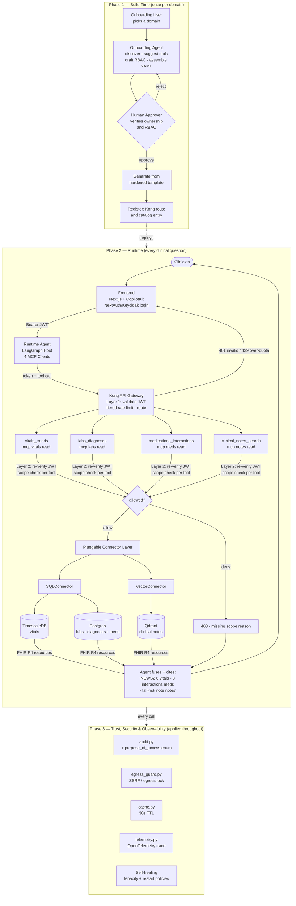

# MCP-Data-Factory

**Patient Risk Intelligence MCP Platform** — an agentic [Model Context Protocol](https://modelcontextprotocol.io)
layer that gives clinicians a live, explainable, multi-domain risk picture of a patient,
fused from four independently governed data domains.

Built entirely from free, self-hosted, open-source components and fed by fully synthetic
FHIR R4 patient data ([Synthea](https://github.com/synthetichealth/synthea)) — zero real PHI.

> See [`PRD Docs/`](PRD%20Docs/) for the full Product Requirements Documents. This README
> summarizes the problem, the solution, and the end-to-end workflow.

---

## Problem Statement

Bedside nurses, physicians, and case managers need a unified, real-time view of a patient's
risk — not just a retrospective readmission score. Today the signals that matter are scattered:
vitals trends in one system, lab/diagnosis history in another, medications and interactions in a
third, and the richest signals — a note mentioning a fall, a family-history detail, a subtle
change in clinical narrative — buried in free-text documents nobody has time to re-read every shift.

This creates three concrete problems:

- **Speed** — early warning signs are caught late because no single view fuses structured and
  unstructured signals.
- **Explainability** — a risk number with no citation to its source signals is not actionable or
  trustworthy at the bedside.
- **Access governance** — different roles need different slices of this data (a nurse should not
  see medication-interaction detail; a case manager needs notes but not raw vitals), and today's
  systems neither enforce that consistently nor record *why* PHI was accessed.

## Proposed Solution

A multi-domain agentic MCP layer where each risk dimension — **vitals trends**,
**labs/diagnoses**, **medications/interactions**, and **clinical notes** — is its own
independently governed MCP server. A runtime [LangGraph](https://www.langchain.com/langgraph)
agent fuses all four into one explainable summary, **citing which signal came from which source**,
when asked something like *"What is this patient's overall risk picture?"*

Key properties:

- **One hardened template → four servers.** Every server inherits the same Fixed Core (auth,
  audit, egress guard, cache, telemetry) — unmodifiable by the connector or blueprint.
- **One connector interface, two implementations.** A SQL connector (TimescaleDB/Postgres) for
  three servers and a Vector connector (Qdrant) for clinical notes — proving the architecture is
  genuinely source-agnostic.
- **FHIR R4 everywhere.** Outputs are shaped as `Observation` / `Condition` /
  `MedicationStatement` / `DocumentReference`, carrying LOINC / RxNorm / SNOMED-CT codes.
  Deterioration risk uses **NEWS2**, a published NHS algorithm — not an invented formula.
- **Two-layer, deny-by-default RBAC.** Kong (Layer 1) validates the token and rate-limits; each
  server (Layer 2) re-verifies the JWT and checks scope per tool, returning an explained 403.
- **Auditable.** Every PHI touch is logged with who / what / when / outcome and a fixed-enum
  `purpose_of_access`.

### RBAC Matrix

| Role | vitals_trends | labs_diagnoses | medications_interactions | clinical_notes_search |
| --- | :---: | :---: | :---: | :---: |
| clinical-viewer (nurse) | Allow | Allow | Deny | Deny |
| physician | Allow | Allow | Allow | Allow |
| case-manager | Deny | Deny | Deny | Allow |

---

## End-to-End Workflow



### Reading the diagram

- **Build-time** runs once per domain: an agent proposes a blueprint, a human approves it, the
  hardened template generates the server, and it's registered (Kong route + catalog).
- **Runtime** is the live path: clinician → frontend → LangGraph agent → Kong (Layer 1) → the
  four MCP servers (Layer 2 RBAC) → connectors → data stores → fused, cited FHIR answer.
- **Trust** controls (audit, egress guard, cache, telemetry, self-healing) wrap every call.

---

## Repository Layout

```
infra/postgres/      # vitals / labs / diagnoses / medications schemas
infra/synthea/       # Synthea loader + demo_patient_aliases.json
backend/shared/      # Fixed Core: connector ABC, auth, audit, cache, egress guard, ...
backend/connectors/  # sql_connector.py, vector_connector.py
backend/servers/     # the 4 MCP servers
backend/tests/       # RBAC matrix, self-healing
docker-compose.data.yml      # data stores (Person A's half)
PRD Docs/                    # full PRDs
```

Backend/data setup and run instructions live in [`backend/README.md`](backend/README.md).

## Tech Stack

Python 3.12 · FastAPI · MCP SDK (2025-11-25) · TimescaleDB · PostgreSQL 16 · Qdrant ·
Synthea · NEWS2 · Kong · Keycloak · LangGraph · Next.js · OpenTelemetry · Docker Compose.
