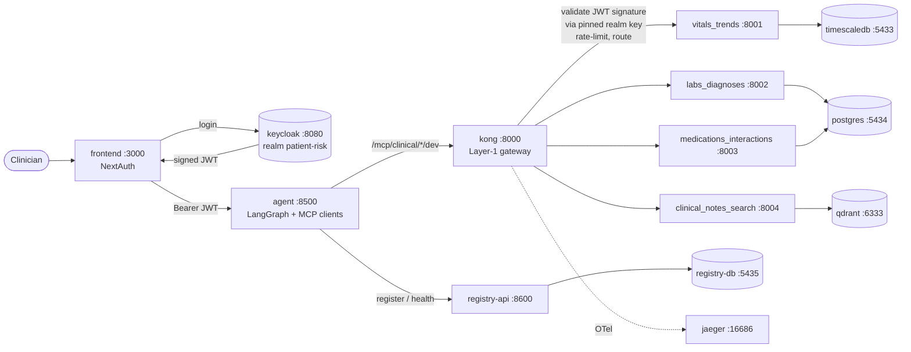

# MCP-Data-Factory

**Patient Risk Intelligence MCP Platform** — an agentic [Model Context Protocol](https://modelcontextprotocol.io)
layer that gives clinicians a live, explainable, multi-domain risk picture of a patient,
fused from four independently governed data domains.

Built entirely from free, self-hosted, open-source components and fed by fully synthetic
FHIR R4 patient data ([Synthea](https://github.com/synthetichealth/synthea)) — zero real PHI.

> See [`PRD Docs/`](PRD%20Docs/) for the full Product Requirements Documents (PDFs + Person A
> status summary). This README summarizes the problem, the solution, and the end-to-end workflow.

**Docs index** (all in [`docs/`](docs/)): [`IMPLEMENTATION.md`](docs/IMPLEMENTATION.md) (setup, any OS) ·
[`MCP_SERVERS.md`](docs/MCP_SERVERS.md) (how each server is built) ·
[`INFRASTRUCTURE.md`](docs/INFRASTRUCTURE.md) (Kong, Keycloak, databases) ·
[`DATA_CHECKING.md`](docs/DATA_CHECKING.md) (browse SQL + Qdrant in the browser) ·
[`backend/README.md`](backend/README.md) (backend detail) ·
[`CHANGELOG.md`](docs/CHANGELOG.md) (what changed + commands) ·
[`PERSON_B_SYNC.md`](docs/PERSON_B_SYNC.md) (Person B: do-before-building checklist) ·
[`HANDOVER_PERSON_B.md`](docs/HANDOVER_PERSON_B.md) (integration contract).

---

## Problem Statement

Bedside nurses, physicians, and case managers need a unified, real-time view of a patient's
risk — not just a retrospective readmission score. Today the signals that matter are scattered:
vitals trends in one system, lab/diagnosis history in another, medications and interactions in a
third, and the richest signals — a note mentioning a fall, a family-history detail, a subtle
change in clinical narrative — buried in free-text documents nobody has time to re-read every shift.

This creates three concrete problems:

- **Speed** — early warning signs are caught late because no single view fuses structured and
  unstructured signals.
- **Explainability** — a risk number with no citation to its source signals is not actionable or
  trustworthy at the bedside.
- **Access governance** — different roles need different slices of this data (a nurse should not
  see medication-interaction detail; a case manager needs notes but not raw vitals), and today's
  systems neither enforce that consistently nor record *why* PHI was accessed.

## Proposed Solution

A multi-domain agentic MCP layer where each risk dimension — **vitals trends**,
**labs/diagnoses**, **medications/interactions**, and **clinical notes** — is its own
independently governed MCP server. A runtime [LangGraph](https://www.langchain.com/langgraph)
agent fuses all four into one explainable summary, **citing which signal came from which source**,
when asked something like *"What is this patient's overall risk picture?"*

Key properties:

- **One hardened template → four servers.** Every server inherits the same Fixed Core (auth,
  audit, egress guard, cache, telemetry) — unmodifiable by the connector or blueprint.
- **One connector interface, two implementations.** A SQL connector (TimescaleDB/Postgres) for
  three servers and a Vector connector (Qdrant) for clinical notes — proving the architecture is
  genuinely source-agnostic.
- **FHIR R4 everywhere.** Outputs are shaped as `Observation` / `Condition` /
  `MedicationStatement` / `DocumentReference`, carrying LOINC / RxNorm / SNOMED-CT codes.
  Deterioration risk uses **NEWS2**, a published NHS algorithm — not an invented formula.
- **Two-layer, deny-by-default RBAC.** Kong (Layer 1) validates the token and rate-limits; each
  server (Layer 2) re-verifies the JWT and checks scope per tool, returning an explained 403.
- **Auditable.** Every PHI touch is logged with who / what / when / outcome and a fixed-enum
  `purpose_of_access`.

### RBAC Matrix

| Role | vitals_trends | labs_diagnoses | medications_interactions | clinical_notes_search |
| --- | :---: | :---: | :---: | :---: |
| clinical-viewer (nurse) | Allow | Allow | Deny | Deny |
| physician | Allow | Allow | Allow | Allow |
| case-manager | Deny | Deny | Deny | Allow |

---

## End-to-End Workflow


### Reading the diagram

- **Build-time** runs once per domain: an agent proposes a blueprint, a human approves it, the
  hardened template generates the server, and it's registered (Kong route + catalog).
- **Runtime** is the live path: clinician → frontend → LangGraph agent → Kong (Layer 1) → the
  four MCP servers (Layer 2 RBAC) → connectors → data stores → fused, cited FHIR answer.
- **Trust** controls (audit, egress guard, cache, telemetry, self-healing) wrap every call.

---

## Infrastructure Flow (runtime path)

How Docker services, Kong, and the host-run MCP servers connect at runtime (detail in
[`INFRASTRUCTURE.md`](docs/INFRASTRUCTURE.md)):



**Two security layers:** Kong is **Layer 1** (is the token valid? not over quota? route it).
Each MCP server is **Layer 2** (does this token's `scp` + `groups[]` allow this tool?). Both must pass.

### Port reference

| Service | Port | Owner |
| --- | --- | --- |
| Kong proxy | 8000 | Person B |
| Kong admin | 8101 | Person B |
| Keycloak | 8080 | Person B |
| Registry API | 8600 | Person B |
| Registry DB | 5435 | Person B |
| Jaeger UI | 16686 | Person B |
| Runtime agent | 8500 | Person B |
| Frontend (Next.js) | 3000 | Person B |
| MCP vitals_trends | 8001 | Person A (host) |
| MCP labs_diagnoses | 8002 | Person A (host) |
| MCP medications_interactions | 8003 | Person A (host) |
| MCP clinical_notes_search | 8004 | Person A (host) |
| TimescaleDB | 5433 | Person A |
| Postgres clinical | 5434 | Person A |
| Qdrant | 6333 | Person A |
| pgAdmin (optional) | 5050 | Person A |

---

## Run Backend + Platform + Frontend

Three layers — run in this order. MCP servers stay **on the host**; Kong reaches them via
`host.docker.internal` (see [`HANDOVER_PERSON_B.md`](docs/HANDOVER_PERSON_B.md)).

### Layer 1 — Person A backend (data + MCP servers)

```bash
cd /path/to/MCP-Data-Factory
git checkout person-a/phase-2
cp .env.example .env                    # once; fill passwords
source .venv/bin/activate
set -a && source .env && set +a

# Data stores
docker compose up -d
docker compose ps

# Synthetic data (first time or after schema change)
# curl -sL -o infra/synthea/synthea-with-dependencies.jar \
#   https://github.com/synthetichealth/synthea/releases/download/v4.0.0/synthea-with-dependencies.jar
# uv run python infra/synthea/load_patients.py
# LOAD_NOTES=true uv run python infra/synthea/load_patients.py   # Qdrant notes for :8004

# All 4 MCP servers (Terminal 1 — leave running)
bash scripts/start_mcp_servers.sh
```

Direct URLs (bypass Kong — good for Person A dev):

| Server | Health | MCP |
| --- | --- | --- |
| vitals_trends | http://localhost:8001/health | http://localhost:8001/mcp |
| labs_diagnoses | http://localhost:8002/health | http://localhost:8002/mcp |
| medications_interactions | http://localhost:8003/health | http://localhost:8003/mcp |
| clinical_notes_search | http://localhost:8004/health | http://localhost:8004/mcp |

### Layer 2 — Person B platform (Docker)

```bash
# Core platform + data (Keycloak, Kong, registry, Jaeger, DBs)
docker compose up -d

# Optional SQL browser
docker compose --profile tools up -d pgadmin    # -> http://localhost:5050

# Verify platform
curl -s http://localhost:8080/realms/patient-risk | head -c 80    # Keycloak realm
curl -s http://localhost:8101/routes | python3 -m json.tool | grep '"paths"'   # Kong routes
curl -s http://localhost:8600/docs                              # Registry API (Swagger)
open http://localhost:16686                                     # Jaeger UI
```

Get a Keycloak token (Person B integration test):

```bash
curl -s -X POST http://localhost:8080/realms/patient-risk/protocol/openid-connect/token \
  -d grant_type=client_credentials \
  -d client_id=patient-risk-agent \
  -d client_secret=agent-secret-change-in-prod
```

**Kong → MCP green path** (requires Layer 1 MCP servers running on host):

```bash
TOK=$(curl -s -X POST http://localhost:8080/realms/patient-risk/protocol/openid-connect/token \
  -d grant_type=client_credentials -d client_id=patient-risk-agent \
  -d client_secret=agent-secret-change-in-prod \
  | python3 -c "import sys,json; print(json.load(sys.stdin)['access_token'])")

for route in vitals-trends labs-diagnoses medications-interactions clinical-notes-search; do
  curl -s -o /dev/null -w "$route %{http_code}\n" \
    "http://localhost:8000/mcp/clinical/$route/dev" -X POST \
    -H "Authorization: Bearer $TOK" \
    -H "Accept: application/json, text/event-stream" \
    -H "Content-Type: application/json" \
    -d '{"jsonrpc":"2.0","id":1,"method":"tools/list"}'
done
# expect four lines ending in 200
```

### Layer 3 — Person B frontend + runtime agent

The `agent/` and `frontend/` directories are **Person B deliverables** — not in Person A's
repo yet. When Person B adds them:

**Option A — Docker (recommended, matches compose):**

```bash
docker compose --profile full up -d
# frontend  -> http://localhost:3000  (Next.js + CopilotKit + NextAuth)
# agent     -> http://localhost:8500  (LangGraph + 4 MCP clients via Kong)
```

**Option B — host-run (Person B local dev):**

```bash
# Terminal — runtime agent (LangGraph; calls Kong, not localhost MCP ports)
cd agent
uv pip install -r requirements.txt
set -a && source ../.env && set +a
uv run python main.py                    # -> http://localhost:8500

# Terminal — frontend (Next.js)
cd frontend
npm install
set -a && source ../.env && set +a
npm run dev                                # -> http://localhost:3000
```

Required `.env` keys for frontend/agent (see `.env.example`):

| Variable | Purpose |
| --- | --- |
| `KEYCLOAK_CLIENT_SECRET` | NextAuth ↔ Keycloak |
| `NEXTAUTH_SECRET` | NextAuth session signing |
| `OPENAI_API_KEY` | Agent answer synthesis |
| `VITALS_MCP_URL` … `NOTES_MCP_URL` | Agent MCP endpoints (via Kong) |

> Person B checklist before building UI: [`PERSON_B_SYNC.md`](docs/PERSON_B_SYNC.md).
> Integration contract (routes, scopes, RBAC): [`HANDOVER_PERSON_B.md`](docs/HANDOVER_PERSON_B.md).

### Split compose files (legacy partial runs)

```bash
docker compose -f docker-compose.data.yml up -d      # Person A data stores only
docker compose -f docker-compose.platform.yml up -d  # Person B platform only
```

---

## Quick Start (Person A — Data & Backend)

> **Setting up on a fresh machine (macOS/Linux or Windows)?** Follow
> **[`IMPLEMENTATION.md`](docs/IMPLEMENTATION.md)** — the full clone-to-running guide with
> prerequisites, the `person-a/phase-2` branch checkout, and OS-specific commands.

The minimal path from clone to populated data stores (details in
[`backend/README.md`](backend/README.md)):

```bash
# --- Phase 0: environment ---------------------------------------------------
cp .env.example .env                         # then fill in passwords
uv venv --python 3.12                         # Python 3.12 (PRD §8; not 3.11)
uv pip install -r requirements.txt
uv run python -c "import fastapi, mcp, qdrant_client, asyncpg, jwt; print('imports OK')"

# --- Phase 1: data stores + schemas ----------------------------------------
docker compose up -d                                   # unified stack (data + platform)
docker compose ps                                      # all healthy
docker exec timescaledb-vitals psql -U postgres -d vitals   -c "\dt"   # verify schemas
docker exec postgres-clinical  psql -U postgres -d clinical -c "\dt"

# --- Phase 2: synthetic data (fixed seed) ----------------------------------
curl -sL -o infra/synthea/synthea-with-dependencies.jar \
  https://github.com/synthetichealth/synthea/releases/download/v4.0.0/synthea-with-dependencies.jar
set -a; . ./.env; set +a
uv run python infra/synthea/load_patients.py           # truncates + reseeds (reproducible)
docker exec timescaledb-vitals psql -U postgres -d vitals -c "SELECT count(*) FROM vitals;"

# --- Phase 2b (optional): clinical notes -> Qdrant -------------------------
# Why early? Populates the 4th data domain now (Qdrant is empty otherwise), lets you
# browse physician notes in the dashboard, and proves the embedding pipeline before Jul 6.
# LOAD_NOTES=true uv run python infra/synthea/load_patients.py
# verify: curl -s http://localhost:6333/collections/clinical_notes
# browse: http://localhost:6333/dashboard

# --- Phase 3: MCP servers (all 4 DB-backed) ----------------------------------
# Option A — all four in one terminal:
bash scripts/start_mcp_servers.sh

# Option B — one terminal per server:
uv run python backend/servers/vitals_trends/main.py              # -> :8001/mcp  mcp.vitals.read
uv run python backend/servers/labs_diagnoses/main.py             # -> :8002/mcp  mcp.labs.read
uv run python backend/servers/medications_interactions/main.py   # -> :8003/mcp  mcp.meds.read
uv run python backend/servers/clinical_notes_search/main.py      # -> :8004/mcp  mcp.notes.read

# --- Phase 4: tests + verify (before push to Person B) -------------------------
uv run pytest backend/tests/ -q                                  # 77 tests (in-process)
bash scripts/start_mcp_servers.sh --verify                       # live health + RBAC + tool calls
uv run python scripts/mcp_inspector_smoke.py                     # live tools/list on :8001–8004
# Notes server needs Qdrant populated: LOAD_NOTES=true uv run python infra/synthea/load_patients.py
# Person B integration checklist: HANDOVER_PERSON_B.md
```

> Ports: TimescaleDB **5433**, Postgres **5434** (5432 was taken locally), Qdrant **6333**,
> MCP servers **8001–8004**. **Browse / verify data:** [`DATA_CHECKING.md`](docs/DATA_CHECKING.md)
> (pgAdmin + Qdrant dashboard + SQL status queries).
> **Clinical notes:** run `LOAD_NOTES=true uv run python infra/synthea/load_patients.py` once
> so Qdrant has the `clinical_notes` collection before starting `:8004`. Browse at
> http://localhost:6333/dashboard.

**Windows — Phase 2b (optional, clinical notes → Qdrant):**

```powershell
cd c:\Users\Bhavna\Desktop\data_factory

Get-Content .env | Where-Object { $_ -match '^\s*[^#].*=' } | ForEach-Object {
    $name, $value = $_ -split '=', 2
    [Environment]::SetEnvironmentVariable($name.Trim(), $value.Trim())
}

$env:LOAD_NOTES="true"
uv run python infra/synthea/load_patients.py
```

Verify: `curl.exe -s http://localhost:6333/collections/clinical_notes`

---

## MCP Servers (all live)

| Server | Port | Scope | Tools |
| --- | --- | --- | --- |
| `vitals_trends` | 8001 | `mcp.vitals.read` | `get_vitals_trend`, `compute_news2_score`, `list_abnormal_vitals` |
| `labs_diagnoses` | 8002 | `mcp.labs.read` | `get_lab_trend`, `get_active_diagnoses`, `get_diagnosis_history` |
| `medications_interactions` | 8003 | `mcp.meds.read` | `get_active_medications`, `check_drug_interactions`, `get_polypharmacy_risk` |
| `clinical_notes_search` | 8004 | `mcp.notes.read` | `semantic_search_notes`, `get_recent_notes`, `get_notes_by_type` |

Each server exposes `/health` (public summary) and `/mcp` (streamable HTTP MCP). Kong routes:
`/mcp/clinical/{vitals-trends,labs-diagnoses,medications-interactions,clinical-notes-search}/dev`.

---

## Verify & Demo (Step-by-Step)

Use **two terminals** — one for servers, one for checks.

### Step 0 — Environment

```bash
cd /path/to/MCP-Data-Factory              # your clone path
git checkout person-a/phase-2
source .venv/bin/activate
set -a && source .env && set +a
```

### Step 1 — Start Docker (data stores)

```bash
docker compose up -d
docker compose ps
```

| Container | Port | Purpose |
| --- | --- | --- |
| `timescaledb-vitals` | 5433 | Vitals |
| `postgres-clinical` | 5434 | Labs, diagnoses, meds |
| `qdrant` | 6333 | Clinical notes (vectors) |
| `data_factory-kong-1` | 8000 | API gateway (Person B) |
| `data_factory-keycloak-1` | 8080 | Auth (Person B) |

### Step 2 — Confirm data exists

```bash
# Vitals
docker exec timescaledb-vitals psql -U postgres -d vitals -c "SELECT count(*) FROM vitals;"

# Labs / diagnoses / meds
docker exec postgres-clinical psql -U postgres -d clinical -c "
  SELECT 'labs' AS t, count(*) FROM labs
  UNION ALL SELECT 'diagnoses', count(*) FROM diagnoses
  UNION ALL SELECT 'medications', count(*) FROM medications;"

# Qdrant notes (after LOAD_NOTES=true load)
curl -s http://localhost:6333/collections/clinical_notes | python3 -m json.tool | grep points_count

# Demo patient alias
cat infra/synthea/demo_patient_aliases.json | head -5
```

Use **`demo-patient-1` UUID** (not the alias string) in direct MCP tool calls — see
[Person A complete — what happens next](#person-a-complete--what-happens-next).

### Step 3 — Browse data in the browser (optional)

| Store | URL |
| --- | --- |
| Qdrant dashboard (notes) | http://localhost:6333/dashboard |
| pgAdmin (SQL) | http://localhost:5050 — start with `docker compose --profile tools up -d pgadmin` |
| Server health summaries | http://localhost:8001/health … http://localhost:8004/health |

See [`DATA_CHECKING.md`](docs/DATA_CHECKING.md) for pgAdmin server registration (use Docker
container hostnames inside pgAdmin, not `localhost`).

### Step 4 — Run tests (no servers required)

```bash
uv run pytest backend/tests/ -q
# expect: 77 passed
```

### Step 5 — Start all 4 MCP servers

**Terminal 1** (leave running):

```bash
bash scripts/start_mcp_servers.sh
```

You should see `[ready] :8001` through `:8004`, then `[running] MCP servers up`.

### Step 6 — Live checks (Terminal 2)

```bash
# Health on all four
for p in 8001 8002 8003 8004; do
  echo -n ":$p → "
  curl -s http://localhost:$p/health | python3 -c "import sys,json; d=json.load(sys.stdin); print(d['service'], 'fixed_core='+str(d.get('fixed_core')))"
done

# MCP Inspector smoke (live)
uv run python scripts/mcp_inspector_smoke.py
# expect: 4/4 servers passed

# Full pre-push verify (health + RBAC + live tool calls on demo-patient-1)
uv run python scripts/pre_push_verify.py
# expect: 14/14 checks passed
```

One-shot verify (starts servers, runs checks, stops them):

```bash
bash scripts/start_mcp_servers.sh --verify
```

### Step 7 — Call a real tool (live data)

```bash
TOKEN=$(python3 -c "
import jwt
print(jwt.encode(
  {'sub':'demo-user','scp':'mcp.vitals.read mcp.labs.read mcp.meds.read mcp.notes.read','groups':['grp-physician']},
  'x'*32, algorithm='HS256'))
")

curl -s -X POST http://localhost:8001/mcp \
  -H "Accept: application/json, text/event-stream" \
  -H "Content-Type: application/json" \
  -H "Authorization: Bearer $TOKEN" \
  -d '{"jsonrpc":"2.0","id":1,"method":"tools/call","params":{"name":"get_vitals_trend","arguments":{"patient_id":"080b069b-5108-46b6-ecef-6aacd3b9ef3f","hours":24}}}'
```

Get UUID: `python3 -c "import json; print(json.load(open('infra/synthea/demo_patient_aliases.json'))['demo-patient-1'])"`

Repeat on `:8002` (labs), `:8003` (meds), `:8004` (notes) with the matching tool names.

### Step 8 — Stop when done

- MCP servers: `Ctrl+C` in Terminal 1
- Docker: `docker compose down` (volumes kept — data persists)
- If pgAdmin was started: `docker compose --profile tools down` (otherwise network may stay in use)

### Quick reference

| What | Command / URL |
| --- | --- |
| All tests | `uv run pytest backend/tests/ -q` |
| Start MCP servers | `bash scripts/start_mcp_servers.sh` |
| Platform (Docker) | `docker compose up -d` |
| Frontend + agent (Docker) | `docker compose --profile full up -d` |
| Full verify | `bash scripts/start_mcp_servers.sh --verify` |
| Inspector (live) | `uv run python scripts/mcp_inspector_smoke.py` |
| Inspector (in-process) | `uv run python scripts/mcp_inspector_smoke.py --in-process` |
| Browse data (SQL) | [`DATA_CHECKING.md`](docs/DATA_CHECKING.md) · pgAdmin http://localhost:5050 |
| Qdrant UI | http://localhost:6333/dashboard |
| Keycloak | http://localhost:8080 |
| Frontend (when built) | http://localhost:3000 |
| Jaeger | http://localhost:16686 |

---

## Directory Structure (Person A)

`[x]` = built · `[~]` = stub/partial · `[ ]` = planned this sprint.

```
MCP-Data-Factory/
├── docker-compose.yml               [x]  unified stack (data + platform, Jul 8)
├── docker-compose.data.yml          [x]  data stores only (legacy split)
├── docker-compose.platform.yml      [x]  platform only (legacy split)
├── pytest.ini                       [x]  asyncio_mode = auto; testpaths = backend/tests
├── requirements.txt / .lock         [x]  pinned deps (Python 3.12)
├── .env.example                     [x]
│
├── scripts/
│   ├── start_mcp_servers.sh         [x]  start all 4 servers; --verify runs pre_push_verify
│   ├── pre_push_verify.py           [x]  live health + RBAC + tool-call acceptance
│   └── mcp_inspector_smoke.py       [x]  live or --in-process tools/list smoke
│
├── infra/
│   ├── postgres/
│   │   ├── init-timescale-vitals.sql    [x]  vitals hypertable
│   │   ├── init-labs-diagnoses.sql      [x]  labs + diagnoses
│   │   ├── init-medications.sql         [x]  medications + interaction_rules
│   │   ├── init-registry-db.sql         [x]  12 control-plane tables (Person B)
│   │   └── seed-interaction-rules.sql   [x]  curated RxNorm pairs (demo)
│   ├── keycloak/
│   │   └── realm-export.json            [x]  patient-risk realm + 3 roles (Person B)
│   ├── kong/
│   │   └── kong.yml                     [x]  4 MCP routes + JWT + rate-limit (Person B)
│   └── synthea/
│       ├── load_patients.py             [x]  generate + load + (embed notes)
│       └── demo_patient_aliases.json    [x]  friendly ID -> UUID (determinism)
│
├── backend/
│   ├── registry/                        [x]  registry-api :8600 (Person B platform)
│   │   ├── main.py
│   │   ├── auth.py
│   │   └── models.py
│   ├── shared/                          # Fixed Core (imported by all 4 servers)
│   │   ├── connector_base.py            [x]  Connector ABC
│   │   ├── embeddings.py                [x]  single-source embedding model + fingerprint guard
│   │   ├── middleware.py                [x]  FixedCoreGuard ASGI (JWT + RBAC + audit)
│   │   ├── request_context.py           [x]  claims / purpose / trace for PHI audit
│   │   ├── auth.py                      [x]  JWT verify + RBAC (Layer 2)
│   │   ├── audit.py                     [x]  audit + purpose_of_access enum
│   │   ├── egress_guard.py              [x]  SSRF / egress lock (locked_connector_for)
│   │   ├── cache.py                     [x]  30s TTL cache (@cached)
│   │   ├── self_healing.py              [x]  tenacity retry + pool/client reset
│   │   ├── telemetry.py                 [x]  OpenTelemetry + W3C trace_id propagation
│   │   ├── tool_trust.py                [x]  Kong-origin / tool-poisoning guard
│   │   ├── usage_log.py                 [x]  per-role query/denial counters (+ /usage)
│   │   └── fhir_shape.py                [~]  FHIR R4 shaping done inline in each tools.py
│   ├── connectors/
│   │   ├── sql_connector.py             [x]  TimescaleDB/Postgres (asyncpg, read-only guard)
│   │   └── vector_connector.py          [x]  Qdrant (clinical_notes_search)
│   ├── servers/
│   │   ├── vitals_trends/               [x]  :8001 — get_vitals_trend, NEWS2, list_abnormal_vitals
│   │   ├── labs_diagnoses/              [x]  :8002 — get_lab_trend, diagnoses tools
│   │   ├── medications_interactions/    [x]  :8003 — meds + interaction rules (physician-only)
│   │   └── clinical_notes_search/       [x]  :8004 — semantic + recent + by_type (Qdrant)
│   ├── tests/
│   │   ├── conftest.py                  [x]  repo root on sys.path; AUTH_ALLOW_ANONYMOUS=false
│   │   ├── rbac_fixtures.py             [x]  4×3 matrix constants + mcp_test_client()
│   │   ├── test_rbac_matrix.py          [x]  auth engine unit tests
│   │   ├── test_rbac_matrix_http.py     [x]  HTTP RBAC matrix (4 servers × 3 roles)
│   │   ├── test_mcp_inspector.py        [x]  in-process tools/list + /health smoke
│   │   ├── test_fixed_core.py           [x]  audit, cache, egress guard
│   │   ├── test_self_healing.py         [x]  chaos demo (transient failure retry)
│   │   └── test_clinical_notes_search.py [x]  vector connector + RBAC spot checks
│   └── README.md                        [x]  backend setup + run guide
│
├── agent/                               [ ]  LangGraph runtime (Person B — Jul 3+)
├── frontend/                            [ ]  Next.js + CopilotKit (Person B — Jul 3+)
├── docs/                                [x]  IMPLEMENTATION, MCP_SERVERS, INFRASTRUCTURE, …
└── PRD Docs/                            [x]  full PRDs + README status summary
```

> **Person A scope:** data stores, Synthea loader, 4 MCP servers, Fixed Core, tests.
> **Person B scope (in repo today):** Keycloak, Kong, registry-db, registry-api, Jaeger
> (via `docker-compose.yml`). **Person B scope (not uploaded yet):** `agent/`, `frontend/`,
> onboarding agent. Unified compose merges both halves; split files remain for partial runs.

### Person A delivery status (Jun 28, 2026)

| Milestone | Status |
| --- | --- |
| 4 MCP servers (:8001–8004, 12 tools) | Done |
| Fixed Core (auth, audit, egress, cache, middleware) | Done |
| Self-healing (tenacity on connectors) | Done |
| Unified `docker-compose.yml` | Done |
| RBAC matrix tests (4×3 HTTP + auth engine) | Done — **77 pytest passing** |
| MCP Inspector smoke | Done — `scripts/mcp_inspector_smoke.py` |
| Hardening modules: telemetry · tool_trust · usage_log | Done — trace_id propagates to audit; `/usage` per-role counters |
| Jul 9 demo / optional PRD modules | `fhir_shape.py` done inline in each `tools.py` (no shared module) |

---

## Person A complete — what happens next

**Status (Jun 28, 2026):** Person A sprint is **done** (10/11 tasks). Code is on GitHub:
[`person-a/phase-2`](https://github.com/aakash-p-s/MCP-Data-Factory/tree/person-a/phase-2)
and merged into [`main`](https://github.com/aakash-p-s/MCP-Data-Factory).

**Verified acceptance:** 77 pytest · MCP Inspector 4/4 · pre-push verify 14/14 · live FHIR
tool calls on all four servers.

### Still open (Person A — Jul 9 only)

- **Live demo support** — keep servers running when Person B integrates; fix integration bugs
  if contracts break (no new features unless agreed).
- **`fhir_shape.py`** — FHIR R4 shaping currently lives inline in each server's `tools.py`
  (functionally complete); extracting it into a shared module is optional polish.
- **Docker auto-restart** — `restart: unless-stopped` is set on every data container, but a
  hard `docker kill` did not auto-restart the DB in local testing (in-process connector
  self-healing still recovered the call without restarting the MCP server). Verify the
  container restart policy in the target environment.

### Person B builds next (not Person A)

| Deliverable | Port | Owner |
| --- | --- | --- |
| Keycloak `scp` + `groups[]` mappers | 8080 | Person B |
| Kong → MCP upstream wiring | 8000 | Person B |
| Runtime agent (LangGraph + 4 MCP clients) | 8500 | Person B |
| Frontend (Next.js + CopilotKit + NextAuth) | 3000 | Person B |
| Onboarding agent (build-time) | — | Person B (later) |

Person B starts with [`docs/PERSON_B_SYNC.md`](docs/PERSON_B_SYNC.md) then
[`docs/HANDOVER_PERSON_B.md`](docs/HANDOVER_PERSON_B.md).

### What Person A must keep available for integration

When Person B is ready, Person A runs:

```bash
docker compose up -d
bash scripts/start_mcp_servers.sh    # :8001–8004 on host
```

Person B tests via **Kong** (`:8000`) and the **agent/frontend** — not direct `:8001` curls.

### Demo patient — important for tool calls

Friendly aliases (`demo-patient-1`) live in
[`infra/synthea/demo_patient_aliases.json`](infra/synthea/demo_patient_aliases.json).
**MCP tools query the DB by UUID**, not alias:

| Alias | UUID (use in direct MCP `patient_id`) |
| --- | --- |
| `demo-patient-1` | `080b069b-5108-46b6-ecef-6aacd3b9ef3f` |

Person B's agent should **resolve alias → UUID** before calling tools. Direct curl without
that mapping returns empty results for SQL/Qdrant lookups.

**Demo highlights for `demo-patient-1`:** hypertension, IHD, hyperlipidemia; meds include
lisinopril + naproxen (interaction rule in DB).

### Clinical notes in Qdrant

If `get_recent_notes` returns empty for a patient who has a `.txt` file under
`infra/synthea/output/notes/`, reload embeddings **without** truncating SQL:

```bash
LOAD_NOTES=true uv run python -c "
from pathlib import Path
from infra.synthea.load_patients import embed_and_load_notes
embed_and_load_notes(Path('infra/synthea/output/fhir'))
"
```

### Docker shutdown notes

```bash
docker compose down              # stops main stack; keeps volumes (data safe)
docker compose --profile tools down   # also stops pgAdmin (:5050) if it was started
```

If you see `Network data_factory_default Resource is still in use`, **pgAdmin** is usually
still running — use `--profile tools down` above.

> **Deviation from PRD §5.1.2 (intentional):** the PRD says to pin
> `all-MiniLM-L6-v2` *inside both* `load_patients.py` and `vector_connector.py`. We instead
> keep it in **one** module — [`backend/shared/embeddings.py`](backend/shared/embeddings.py) —
> that both import, so the model name + dimension can never drift. The module also stamps the
> model into the Qdrant collection and asserts it on startup, turning a silent mismatch into a
> loud error. Same requirement, stronger guarantee — no contract/tool/scope change.

## Tech Stack

Python 3.12 · FastAPI · MCP SDK (2025-11-25) · TimescaleDB · PostgreSQL 16 · Qdrant ·
Synthea · NEWS2 · Kong · Keycloak · LangGraph · Next.js · OpenTelemetry · Docker Compose.
