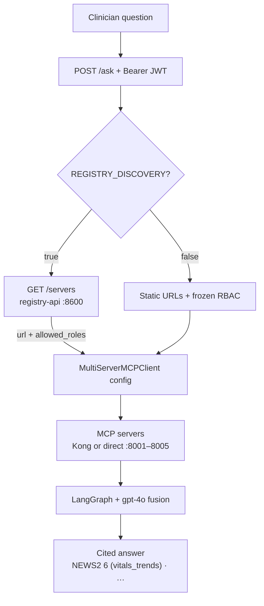

# Runtime Agent — Patient Risk Intelligence MCP Platform

LangGraph MCP Host (Person B PRD §5.5 / Codebase PRD §5.7).

Holds 4 MCP Clients (one per server), attaches the caller's Bearer token to every
MCP request, calls all 4 servers, and fuses results into one cited clinical risk answer.

---

## What it does



---

## Run locally (without Docker)

```bash
# From repo root — venv must be active
uv pip install -r agent/requirements.txt
uv run uvicorn agent.runtime_agent:app --host 0.0.0.0 --port 8500
```

Or from inside the agent/ folder:

```bash
cd agent
uv run uvicorn runtime_agent:app --host 0.0.0.0 --port 8500
```

---

## Run with Docker

```bash
docker compose --profile full up -d agent
```

Or build and run manually:

```bash
docker build -t patient-risk-agent ./agent
docker run -p 8500:8500 \
  -e OPENAI_API_KEY=sk-... \
  -e VITALS_MCP_URL=http://host.docker.internal:8000/mcp/clinical/vitals-trends/dev \
  patient-risk-agent
```

---

## Test the /ask endpoint

```bash
# Get a token first
TOKEN=$(curl -s -X POST http://localhost:8080/realms/patient-risk/protocol/openid-connect/token \
  -d "client_id=patient-risk-agent" \
  -d "client_secret=agent-secret-change-in-prod" \
  -d "username=doctor-test" \
  -d "password=test123" \
  -d "grant_type=password" \
  -d "scope=openid" | python3 -c "import sys,json; print(json.load(sys.stdin)['access_token'])")

# Ask a question (use demo-patient-1 alias — resolved to UUID automatically)
curl -s -X POST http://localhost:8500/ask \
  -H "Content-Type: application/json" \
  -H "Authorization: Bearer $TOKEN" \
  -d '{
    "question": "What is this patient overall risk picture?",
    "patient_id": "demo-patient-1",
    "purpose_of_access": "deterioration_review"
  }'
```

---

## Environment variables

| Variable | Default | Description |
|---|---|---|
| `VITALS_MCP_URL` | Kong vitals route | URL for vitals_trends MCP server |
| `LABS_MCP_URL` | Kong labs route | URL for labs_diagnoses MCP server |
| `MEDS_MCP_URL` | Kong meds route | URL for medications_interactions MCP server |
| `NOTES_MCP_URL` | Kong notes route | URL for clinical_notes_search MCP server |
| `OPENAI_API_KEY` | required | OpenAI API key for LLM synthesis |
| `OTEL_EXPORTER_OTLP_ENDPOINT` | http://jaeger:4317 | Jaeger trace endpoint |

---

## purpose_of_access enum (PRD §6.4)

Must be one of:
- `deterioration_review`
- `medication_reconciliation`
- `discharge_planning`
- `care_coordination`
- `routine_review` (default)

---

## Demo patient aliases

`demo-patient-1` through `demo-patient-31` are resolved to real Synthea UUIDs
automatically by the agent. The alias map lives in
`infra/synthea/demo_patient_aliases.json`.

`demo-patient-1` = `080b069b-5108-46b6-ecef-6aacd3b9ef3f` (Chester802 Aufderhar910)
