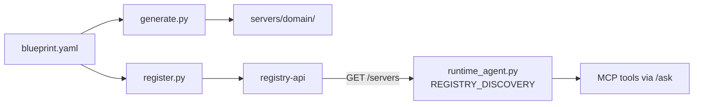

# Changelog

Notable changes to the platform, newest first. Commands that changed for everyone are
called out so other machines can stay in sync. See [`PERSON_B_SYNC.md`](PERSON_B_SYNC.md)
for the sync reference checklist.

---

## 2026-07-06 — Full platform delivery complete (Person A + Person B)

Person B frontend, runtime agent integration, and end-to-end QA verified. All blocking
work is done.

| Area | Status |
| --- | --- |
| Frontend (`/chat`, `/dashboard`, anomaly panel) | Done |
| Runtime agent + registry discovery | Done |
| Live health polling on dashboard | Done |
| LangSmith tracing (`scripts/verify_langsmith.py`) | Done |
| CORS, agent proxy routes, SSO logout, light theme | Done (`b00ed39`) |
| Docs updated — no pending deliverables | Done |

**QA log:** [`troubleshooting.md`](troubleshooting.md) (items 1–13, Jul 3 + Jul 6 passes).

**Repo:** https://github.com/aakash-p-s/MCP-Data-Factory

---

## 2026-07-01 — Onboarding ↔ runtime bridge (factory + discovery)



### New modules
- **`backend/onboarding_agent/generate.py`** — approved blueprint → runnable
  `backend/servers/<domain>/` (main, tools scaffold, Dockerfile).
- **`backend/onboarding_agent/register.py`** — blueprint → `registry-api POST /servers`
  (tools, RBAC, port, kong_route); `--health` sweep → `health_checks` table.

### Runtime agent
- **`agent/runtime_agent.py`** — `discover_servers()` reads `GET /servers` when
  `REGISTRY_DISCOVERY=true`; data-driven RBAC in `_build_server_config()`.
- Env: `REGISTRY_DISCOVERY`, `REGISTRY_URL`, `DISCOVERY_VIA` (`direct` \| `kong`).

### Demo domain
- **`radiology_reports`** — onboarding CLI tested; server generated on `:8005`;
  egress guard entry added; blueprint in `backend/onboarding_agent/output/`.

### Tests + docs
- **`backend/tests/test_onboarding_agent.py`** — 10 golden-file RBAC tests passing.
- **`backend/onboarding_agent/README_CLI_TESTING.md`** — full CLI walkthrough.
- **`docs/ONBOARDING_RUNTIME_BRIDGE.md`** — bridge architecture, recent updates, test commands.

### Enable discovery locally
```bash
# .env
REGISTRY_DISCOVERY=true
DISCOVERY_VIA=direct

uv run python -m backend.onboarding_agent.register --all
uv run uvicorn agent.runtime_agent:app --host 0.0.0.0 --port 8500
```

---

## 2026-06-28 — Person A handoff complete (docs + GitHub)

### Delivery status
- Person A sprint **done** (10/11 tasks; Jul 9 = demo support only).
- Pushed to **`person-a/phase-2`** and merged to **`main`** on
  https://github.com/aakash-p-s/MCP-Data-Factory

### Documentation
- **README.md** — Person A complete / what happens next; demo patient UUID; Qdrant reload; Docker shutdown (pgAdmin profile).
- **HANDOVER_PERSON_B.md** — delivery complete section; updated one-line handoff.
- **PERSON_B_SYNC.md** — Person A status banner; clone step; Qdrant notes reload; Person B build checklist.
- **PRD Docs/README.md** — Person B next steps + Jul 9 support role.

### Operational notes (for demos)
- MCP `patient_id` must be **Synthea UUID** (resolve `demo-patient-1` via `demo_patient_aliases.json`).
- `docker compose --profile tools down` stops pgAdmin when network stays in use after `docker compose down`.

---

## 2026-07-08 — MCP Inspector + full RBAC matrix (Jul 3/8 acceptance)

### HTTP-level RBAC matrix
- **`backend/tests/test_rbac_matrix_http.py`** — parametrized **4 servers × 3 roles** against
  `FixedCoreGuard` via Starlette `TestClient` (MCP lifespan + transport-security host).
  Expect **200** (allowed), **403** (forbidden), or **401** (no Bearer).
- **`backend/tests/rbac_fixtures.py`** — shared matrix constants, JWT helpers, `mcp_test_client()`.
- Cross-check: **`test_rbac_matrix_auth_engine_matches_http`** keeps HTTP matrix aligned with
  `auth.evaluate()`.

### MCP Inspector smoke
- **`backend/tests/test_mcp_inspector.py`** — physician `tools/list` + `/health` on all 4 servers
  (12 frozen tool names).
- **`scripts/mcp_inspector_smoke.py`** — live `:8001–8004` or **`--in-process`** (no running servers).

### Test count
- **62 pytest passing** (`uv run pytest backend/tests/ -q`).

---

## 2026-07-08 — unified `docker-compose.yml`

### Single compose file for the full stack
- **`docker-compose.yml`** merges Person A data stores + Person B platform (Keycloak, Kong,
  registry-db, registry-api, Jaeger). Optional profiles: `tools` (pgAdmin), `full` (agent + frontend).
- Split files **`docker-compose.data.yml`** and **`docker-compose.platform.yml`** remain for
  partial runs; headers point to the unified file.
- Duplicate platform `pgadmin` removed (one pgAdmin in unified/data compose, `--profile tools`).
- **`CLINICAL_PORT` default aligned to 5434** in `docker-compose.data.yml` (matches `.env.example`).

```bash
docker compose up -d                              # data + platform core
docker compose --profile tools up -d pgadmin     # optional SQL browser
docker compose --profile full up -d               # + agent/frontend when dirs exist
```

---

## 2026-07-07 — self-healing (tenacity + connector reset)

### `backend/shared/self_healing.py`
- **`run_with_self_healing()`** — exponential backoff retry (default 3 attempts) on transient
  connection errors (asyncpg pool stale, Qdrant unreachable). Optional **reset** callback
  drops pool/client before retry.
- Wired into **`SQLConnector`** and **`VectorConnector`** `connect()`, `query()`, and `schema()`.
- Docker **`restart: unless-stopped`** handles process crashes; self-healing handles in-process blips.

### Tests
- **`backend/tests/test_self_healing.py`** — chaos demo: simulated stale pool → retry → success;
  logic errors are not retried.

### Env
```
SELF_HEAL_MAX_ATTEMPTS=3
```

---

## 2026-07-06 — clinical_notes_search vector server (4th MCP domain)

### `clinical_notes_search` is now Qdrant-backed
- **`backend/connectors/vector_connector.py`** — `VectorConnector(Connector)` over Qdrant; same
  interface as `SQLConnector`. Embedding fingerprint verified on connect via `assert_model_matches()`.
- **`backend/servers/clinical_notes_search/`** — three tools:
  `semantic_search_notes`, `get_recent_notes`, `get_notes_by_type` → FHIR `DocumentReference`.
- **RBAC:** physician + case-manager allow; clinical-viewer deny (`mcp.notes.read`).
- **Requires notes in Qdrant** — run once with notes enabled:
  ```bash
  LOAD_NOTES=true uv run python infra/synthea/load_patients.py
  uv run python backend/servers/clinical_notes_search/main.py   # -> http://localhost:8004/mcp
  ```
- **`egress_guard.py`** extended — `locked_connector_for("clinical_notes_search")` returns `VectorConnector`.

---

## 2026-07-02 — Fixed Core hardening (auth + audit + egress + cache)

### Shared `FixedCoreGuard` replaces per-server `ScopeGuard`
- **`backend/shared/middleware.py`** — one ASGI guard for all three SQL servers: JWT verify
  (via `auth.py`), scope + group RBAC, auth-level audit, request context for PHI audit.
- **`backend/shared/request_context.py`** — per-request claims / `X-Purpose-Of-Access` / trace id.
- **No token → 401** by default (`AUTH_ALLOW_ANONYMOUS=true` restores POC anonymous access).
- **Signature verify** gated by `AUTH_VERIFY_SIGNATURE=true` (flip on once Keycloak `scp` mapping is wired).

### `auth.py` — Layer-2 engine
- JWKS signature verify (RS256) when enabled; scope (`scp`) + group (`groups[]`) deny-by-default RBAC.

### `audit.py` — every PHI touch logged
- Auth gate + each tool call writes `AUDIT {who, what, when, outcome, purpose_of_access}` to stdout.
- `purpose_of_access` is a **fixed enum** (`routine_review`, `deterioration_review`, …); pass via
  `X-Purpose-Of-Access` header (invalid values fall back to `routine_review`).

### `egress_guard.py` — connectors locked at construction
- Servers call `locked_connector_for("<domain>")` — DSN resolved from allow-list only; no runtime redirection.

### `cache.py` — 30s TTL on read-heavy tools
- `@cached(30)` on `get_vitals_trend` and `get_lab_trend` (per blueprint).

### Tests
- `backend/tests/test_rbac_matrix.py` — 3-role scope/group matrix
- `backend/tests/test_fixed_core.py` — audit enum, cache TTL, egress guard

### New `.env` vars (see `.env.example`)
```
AUTH_VERIFY_SIGNATURE=false   # true once Keycloak scp mapping is live
AUTH_ALLOW_ANONYMOUS=false    # true for local POC without tokens
```

---

## 2026-06-30 — labs + meds servers, interim RBAC matrix, interaction rules seed

### `labs_diagnoses` is now DB-backed (was planned Jun 30)
- `backend/servers/labs_diagnoses/` — `get_lab_trend`, `get_active_diagnoses`, `get_diagnosis_history`
  query live Postgres via `SQLConnector(CLINICAL_DB_URL)`.
- **Contract unchanged** (tool names, scope `mcp.labs.read`, route, FHIR shape, 403).
  ```bash
  uv run python backend/servers/labs_diagnoses/main.py     # -> http://localhost:8002/mcp
  ```

### `medications_interactions` is now DB-backed (was planned Jul 1)
- `backend/servers/medications_interactions/` — `get_active_medications`, `check_drug_interactions`,
  `get_polypharmacy_risk` over Postgres + curated `interaction_rules` table.
- **Illustrative only** — the rule set is a small open RxNorm demo, not a licensed clinical DB.
- **Contract unchanged** (scope `mcp.meds.read`, route, FHIR `MedicationStatement`, 403).
  ```bash
  uv run python backend/servers/medications_interactions/main.py   # -> http://localhost:8003/mcp
  ```

### Curated drug-interaction rules seeded on first Postgres init
- `infra/postgres/seed-interaction-rules.sql` — six RxNorm pairs (e.g. lisinopril + naproxen on
  `demo-patient-1`) auto-loaded via `docker-compose.data.yml` init hook.
- **⚠ action — only if Postgres volume already existed before this file landed:**
  ```bash
  docker exec -i postgres-clinical psql -U postgres -d clinical \
    < infra/postgres/seed-interaction-rules.sql
  ```
  Or reset the clinical volume: `docker compose -f docker-compose.data.yml down -v && up -d`,
  then re-run the loader.

### Interim group-based RBAC on all three SQL servers
- `vitals_trends`, `labs_diagnoses`, and `medications_interactions` now enforce the blueprint
  **RBAC matrix** when a bearer token carries `groups[]` — e.g. case-manager is denied vitals/labs
  even with a coarse `scp`; meds is **physician-only** (clinical-viewer denied).
- Service-account tokens with no `groups` still pass (POC-friendly). Full JWT signature verify +
  shared engine lands Jul 2 in `backend/shared/auth.py`.

### Synthea loader: clear output dir before generation
- `infra/synthea/load_patients.py` wipes `infra/synthea/output/` before each run so stale FHIR
  files from a prior jar/version cannot pollute the next load.

---

## 2026-06-28 — integration with Person B, real vitals server, determinism pin

### Synthea version pinned → `v4.0.0` (cross-machine determinism)
- **Why:** the download used `master-branch-latest`, a *moving* tag. Different download
  dates → different builds → different patients at the same seed (A/B datasets drifted).
- **Change:** `infra/synthea/load_patients.py` pins `SYNTHEA_VERSION = v4.0.0` and prints the
  jar build at generation time. Docs updated.
- **⚠ command change — re-download the jar:**
  ```bash
  rm -f infra/synthea/synthea-with-dependencies.jar
  curl -sL -o infra/synthea/synthea-with-dependencies.jar \
    https://github.com/synthetichealth/synthea/releases/download/v4.0.0/synthea-with-dependencies.jar
  ```
- **Data now:** 31 patients (`SYNTHEA_PATIENT_COUNT=31`, seed 42); `demo-patient-1 = 080b069b-5108-46b6-ecef-6aacd3b9ef3f`.
  Reseed reproducibility verified (identical patient + counts) with the pinned v4.0.0 jar.

### `vitals_trends` is now DB-backed (was a stub)
- `backend/connectors/sql_connector.py` — Connector ABC over asyncpg, read-only SELECT guard.
- `backend/servers/vitals_trends/news2.py` — published NHS NEWS2 algorithm.
- `backend/servers/vitals_trends/tools.py` — tools query live TimescaleDB, FHIR-shape rows.
- **Contract unchanged** (tool names, scope, route, FHIR shape, 403). Run command unchanged:
  ```bash
  uv run python backend/servers/vitals_trends/main.py     # -> http://localhost:8001/mcp
  ```

### Kong ↔ Keycloak JWT fixed (was `401 Invalid signature`)
- **Root cause:** placeholder RSA key in `kong.yml` + Keycloak regenerating its key on every
  re-init.
- **Fix:** pinned a **static RSA signing key** in `infra/keycloak/realm-export.json`
  (`rsa-static`, priority 200) with the matching public key in `infra/kong/kong.yml` (+ a
  cross-file note). Survives `down -v`.
- **⚠ command — re-init Keycloak once to pick up the static key:**
  ```bash
  docker compose -f docker-compose.platform.yml down
  docker volume rm data_factory_keycloak_data
  docker compose -f docker-compose.platform.yml up -d keycloak kong registry-db registry-api
  ```

### MCP server host-header fix (was `421 Invalid Host header` behind Kong)
- `backend/servers/vitals_trends/main.py` allow-lists Kong's forwarded Host
  (`host.docker.internal`) via MCP `TransportSecuritySettings` (DNS-rebind protection kept on).
- Extra hosts via `ALLOWED_HOSTS=host1,host2` env if needed.

### Green path verified end-to-end
Real Keycloak token → Kong (signature OK) → stub/real server → `get_vitals_trend` returns a
FHIR `Observation` (HTTP 200).

### Platform integration complete
Keycloak `scp`/`groups[]` mappers, Kong upstreams, runtime agent, and frontend are live.
See [`PERSON_B_SYNC.md`](PERSON_B_SYNC.md) and [`troubleshooting.md`](troubleshooting.md).

---

## 2026-06-26..28 — embeddings single source of truth
- `backend/shared/embeddings.py` owns the embedding model name, collection, and derived
  dimension; the loader and (Jul 6) `vector_connector.py` both import it, so the load-time and
  query-time models can never drift. `ensure_collection()` stamps the model into Qdrant;
  `assert_model_matches()` raises loudly on mismatch. (PRD §5.1.2 implemented as one module.)
- Clinical notes embedded into Qdrant (opt-in): `LOAD_NOTES=true uv run python infra/synthea/load_patients.py`.

## 2026-06-26 — Phases 0–3 (foundation)
- Data stores (`docker-compose.data.yml`): TimescaleDB :5433, Postgres :5434, Qdrant :6333.
- Schemas (`infra/postgres/*.sql`), connector ABC (`backend/shared/connector_base.py`).
- Synthea loader + `demo_patient_aliases.json` (fixed seed).
- Day-1 stub server for `vitals_trends` (hardcoded FHIR) — since replaced by the real server above.
