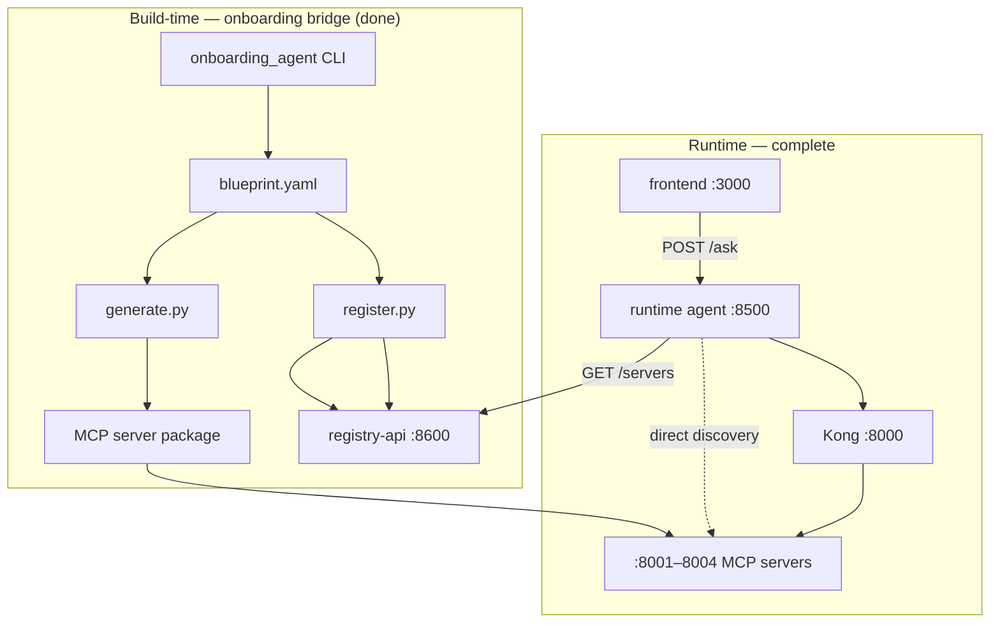
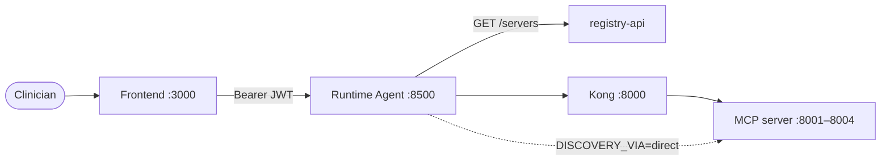

# Person B Handover — MCP Servers & Platform Integration

Checklist for wiring Person B's platform (Keycloak, Kong, registry, runtime agent) to
Person A's **four DB-backed MCP servers** (`vitals_trends`, `labs_diagnoses`,
`medications_interactions`, `clinical_notes_search`). Person A owns data stores + MCP servers; Person B owns
`docker-compose.platform.yml`, auth, gateway, registry, frontend, and agent.

For Person A setup, see [`IMPLEMENTATION.md`](IMPLEMENTATION.md). For architecture, see
[`README.md`](../README.md).

> **Before you build:** run the sync checklist in [`PERSON_B_SYNC.md`](PERSON_B_SYNC.md)
> (re-download Synthea v4.0.0, re-init Keycloak for the static key, add the `scp` scope
> mapping). See [`CHANGELOG.md`](CHANGELOG.md) for the exact command changes.

> **Branch:** clone **`main`** or **`person-a/phase-2`** — both contain the full Person A delivery
> (merged Jun 28, 2026). Repo: https://github.com/aakash-p-s/MCP-Data-Factory
> **Formal compose merge:** Jul 8 — use unified [`docker-compose.yml`](../docker-compose.yml).

---

## Person A delivery complete (Jun 28, 2026)

Person A's sprint is **done**. Acceptance verified:

| Check | Result |
| --- | --- |
| 4 MCP servers (:8001–8004, 12 tools, Fixed Core) | Live |
| RBAC + MCP Inspector tests | 62 pytest · 4/4 smoke · 14/14 pre-push verify |
| Git | Pushed to `person-a/phase-2` + merged to `main` |

**Person A keeps running for integration:**

```bash
docker compose up -d
bash scripts/start_mcp_servers.sh
```

**Person B delivery complete (Jul 6, 2026):** Keycloak, Kong, runtime agent (`:8500`),
frontend (`:3000`), registry integration, and end-to-end QA verified. See
[`PERSON_B_FRONTEND.md`](PERSON_B_FRONTEND.md) and [`troubleshooting.md`](troubleshooting.md).



### Demo patient (direct MCP calls)

MCP tools expect the **Synthea UUID**, not the friendly alias. Resolve via
[`demo_patient_aliases.json`](../infra/synthea/demo_patient_aliases.json):

| Alias | UUID |
| --- | --- |
| `demo-patient-1` | `080b069b-5108-46b6-ecef-6aacd3b9ef3f` |

Person B's agent should map `demo-patient-1` → UUID before tool calls.

### Notes server — Qdrant reload

If `get_recent_notes` is empty but note `.txt` files exist, reload embeddings only:

```bash
LOAD_NOTES=true uv run python -c "
from pathlib import Path
from infra.synthea.load_patients import embed_and_load_notes
embed_and_load_notes(Path('infra/synthea/output/fhir'))
"
```

### Jul 9 — Person A role

Demo **support** only (servers up, contract-stable fixes). No new Person A features unless agreed.

---

## 1. Fixed contract (do not change without same-day notice)

The contract for each server is **frozen** in its `blueprint.yaml` under
`backend/servers/<domain>/`. All four MCP servers are live today.

### vitals_trends

| Field | Value |
| --- | --- |
| Domain | `vitals_trends` |
| Direct MCP URL | `http://localhost:8001/mcp` |
| Kong route | `/mcp/clinical/vitals-trends/dev` |
| Scope | `mcp.vitals.read` |
| Success shape | FHIR R4 `Observation` JSON |
| Denial shape | `403 {"error":{"code":"forbidden","reason":"missing scope mcp.vitals.read"}}` |

**Tools:** `get_vitals_trend`, `compute_news2_score`, `list_abnormal_vitals`

**RBAC:** clinical-viewer ✅ · physician ✅ · case-manager ❌

### labs_diagnoses

| Field | Value |
| --- | --- |
| Direct MCP URL | `http://localhost:8002/mcp` |
| Kong route | `/mcp/clinical/labs-diagnoses/dev` |
| Scope | `mcp.labs.read` |
| Success shape | FHIR R4 `Observation` (labs) / `Condition` (diagnoses) |

**Tools:** `get_lab_trend`, `get_active_diagnoses`, `get_diagnosis_history`

**RBAC:** clinical-viewer ✅ · physician ✅ · case-manager ❌

### medications_interactions

| Field | Value |
| --- | --- |
| Direct MCP URL | `http://localhost:8003/mcp` |
| Scope | `mcp.meds.read` |
| Kong route | `/mcp/clinical/medications-interactions/dev` |
| Success shape | FHIR R4 `MedicationStatement` + interaction dicts |

**Tools:** `get_active_medications`, `check_drug_interactions`, `get_polypharmacy_risk`

**RBAC:** clinical-viewer ❌ · physician ✅ · case-manager ❌ (physician-only)

> `check_drug_interactions` uses a **curated illustrative** RxNorm rule set — not a licensed
> clinical drug-interaction database.

### clinical_notes_search

| Field | Value |
| --- | --- |
| Direct MCP URL | `http://localhost:8004/mcp` |
| Kong route | `/mcp/clinical/clinical-notes-search/dev` |
| Scope | `mcp.notes.read` |
| Success shape | FHIR R4 `DocumentReference` |

**Tools:** `semantic_search_notes`, `get_recent_notes`, `get_notes_by_type`

**RBAC:** clinical-viewer ❌ · physician ✅ · case-manager ✅

> Requires Qdrant populated: `LOAD_NOTES=true uv run python infra/synthea/load_patients.py`

### Shared transport headers

```
Accept: application/json, text/event-stream
Content-Type: application/json
```

---

## 2. What Person A runs (prerequisite for integration)

Person B's Kong upstream must reach a host where Person A has started:

```bash
# Data stores (TimescaleDB, Postgres, Qdrant)
docker compose -f docker-compose.data.yml up -d

# Three SQL MCP servers + notes vector server (one terminal each)
uv run python backend/servers/vitals_trends/main.py
uv run python backend/servers/labs_diagnoses/main.py
uv run python backend/servers/medications_interactions/main.py
uv run python backend/servers/clinical_notes_search/main.py
```

Quick sanity checks:

```bash
curl -s http://localhost:8001/health          # vitals JSON summary
curl -s http://localhost:8002/health          # labs JSON summary
curl -s http://localhost:8003/health          # meds JSON summary
curl -s http://localhost:8004/health          # notes JSON summary
```

Default ports: TimescaleDB **5433**, Postgres **5434**, Qdrant **6333**, MCP **8001–8004**.

---

## 3. Two integration modes

### Mode A — Direct server (debugging, first wire-up)

Point the MCP client / agent at a server **directly**:

| Server | URL |
| --- | --- |
| vitals_trends | `http://localhost:8001/mcp` |
| labs_diagnoses | `http://localhost:8002/mcp` |
| medications_interactions | `http://localhost:8003/mcp` |
| clinical_notes_search | `http://localhost:8004/mcp` |

- Set `AUTH_ALLOW_ANONYMOUS=true` for local POC without Bearer tokens (default requires auth).
- Use this to prove tool discovery + tool calls before Kong is in the path.

If Person B runs Kong/agent in Docker and the servers on the host:

| OS | Kong upstream host |
| --- | --- |
| Docker Desktop (Windows / macOS) | `host.docker.internal:<port>` |
| Linux | host gateway IP or `172.17.0.1:<port>` |

### Mode B — Full path (target runtime)



- Kong (Layer 1): validate JWT, rate-limit, route to `/mcp/clinical/<domain>/dev`.
- Server (Layer 2): verifies JWT via `auth.py`, checks `scp` + `groups[]` against blueprint RBAC.
- Token **without** scope or with disallowed role → fixed `403` envelope.
- Production agent config should use the **Kong URL**, not hardcoded `localhost`.

---

## 4. JWT claims alignment

Person B's Keycloak realm (`patient-risk`) should issue tokens Person A's servers expect.

| Claim | Purpose |
| --- | --- |
| `sub` | User identity (audit) |
| `oid` | Object ID (Azure-style; keep if already validated) |
| `scp` | Space-delimited scopes — **must include the domain scope** (e.g. `mcp.vitals.read`) |
| `groups` | Role mapping — `grp-clinical-viewer`, `grp-physician`, `grp-case-manager` |

`.env.example` on Person A's side already documents:

```
JWKS_URL=http://localhost:8080/realms/patient-risk/protocol/openid-connect/certs
JWT_AUDIENCE=patient-risk
```

**Production auth (Jul 2 Fixed Core):**

| Behavior | Default (Jul 2) | POC bypass |
| --- | --- | --- |
| No token | **401** | `AUTH_ALLOW_ANONYMOUS=true` |
| Invalid/expired token | **401** | — |
| Token, wrong/missing `scp` | **403** envelope | — |
| Token, disallowed `groups[]` | **403** envelope | — |
| JWT signature verify | Off until `AUTH_VERIFY_SIGNATURE=true` | — |

---

## 5. Test patient IDs

All three SQL servers query **live TimescaleDB / Postgres** data from the Synthea loader.
Use friendly aliases from
[`infra/synthea/demo_patient_aliases.json`](../infra/synthea/demo_patient_aliases.json):

```bash
# Example: demo-patient-1 → UUID used in TimescaleDB / Postgres
python -c "import json; print(json.load(open('infra/synthea/demo_patient_aliases.json'))['demo-patient-1'])"
```

---

## 6. MCP SDK version

Pin the **`mcp` package identically** to Person A's [`requirements.txt`](../requirements.txt)
/ [`requirements.lock`](../requirements.lock). A version mismatch breaks Streamable HTTP
tool calls between agent and server.

---

## 7. Registry DB — seed validation

When seeding `mcp_servers` (four records), each row must match its `blueprint.yaml`:

| Domain | Kong route | Scope | Port |
| --- | --- | --- | --- |
| vitals_trends | `/mcp/clinical/vitals-trends/dev` | `mcp.vitals.read` | 8001 |
| labs_diagnoses | `/mcp/clinical/labs-diagnoses/dev` | `mcp.labs.read` | 8002 |
| medications_interactions | `/mcp/clinical/medications-interactions/dev` | `mcp.meds.read` | 8003 |
| clinical_notes_search | `/mcp/clinical/clinical-notes-search/dev` | `mcp.notes.read` | 8004 |

All four servers are live — upstreams on :8001–8004 should all return 200 via Kong when running.

---

## 8. Integration checklist (Person B) — complete

Verified Jul 6, 2026:

- [x] Cloned repo; on branch `person-a/phase-2`
- [x] Person A data stack healthy (`docker compose ps`)
- [x] All five MCP servers running; `/health` returns JSON on :8001–8005
- [x] Qdrant has `clinical_notes` collection (`LOAD_NOTES=true` loader run if empty)
- [x] MCP client calls all tools on each server via **direct** localhost URLs
- [x] Kong routes proxy to upstreams on :8001–8004
- [x] Physician / case-manager token → notes tool calls **succeed** via Kong
- [x] clinical-viewer token → notes **403**; case-manager token → vitals/labs **403**
- [x] Registry `mcp_servers` rows match each `blueprint.yaml`
- [x] Agent runtime path uses Kong URLs (or direct discovery)
- [x] `mcp` SDK version matches Person A's lockfile
- [x] Frontend at `:3000` — chat, dashboard, anomaly panel

---

## 9. When Person A pulls Person B's platform config

| Milestone | What happens |
| --- | --- |
| **Done** | Person B platform merged — Keycloak, Kong, registry, agent, frontend all live. |
| **Done** | Three DB-backed SQL servers live (`vitals_trends`, `labs_diagnoses`, `medications_interactions`) — same contracts, no agent/Kong URL changes from stub era. |
| **Jul 2** | Fixed Core live: shared auth/audit/egress/cache; Bearer required by default. Person B wires Keycloak `scp` + `groups[]`, then flips `AUTH_VERIFY_SIGNATURE=true`. |
| **Jul 6** | `clinical_notes_search` vector server live on :8004 (Qdrant + embeddings). |
| **Jul 8** | **Done** — unified `docker-compose.yml`; MCP Inspector + full 4×3 RBAC re-verify. |
| **Jun 28** | **Done** — pushed to GitHub (`person-a/phase-2` + `main`); Person A handoff complete. |
| **Jul 9** | **Done** — integrated live demo; full stack verified |

### Person A — pull platform config locally

```bash
git fetch origin
git checkout person-a/phase-2
git merge origin/person-b/platform    # adjust branch name to Person B's push
```

Extend `.env` with Kong / Keycloak / registry variables (start from `.env.example` +
Person B's `.env.example` additions). Run:

```bash
docker compose up -d
uv run python backend/servers/vitals_trends/main.py              # :8001
uv run python backend/servers/labs_diagnoses/main.py             # :8002
uv run python backend/servers/medications_interactions/main.py   # :8003
uv run python backend/servers/clinical_notes_search/main.py      # :8004
```

Split compose files still work if you only need half the stack:
`docker compose -f docker-compose.data.yml up -d` +
`docker compose -f docker-compose.platform.yml up -d`.

---

## 10. Ownership summary

| Person A | Person B |
| --- | --- |
| `docker-compose.yml` (unified) | `docker-compose.platform.yml` (legacy split) |
| TimescaleDB, Postgres, Qdrant | Kong, Keycloak |
| Synthea loader + synthetic data | Registry DB, frontend |
| 4 MCP servers (all live) | Runtime agent (LangGraph + MCP clients) |
| SQL + vector connectors | Onboarding agent (build-time) |
| Layer-2 auth hardening (Jul 2) | Layer-1 gateway JWT + rate limits |

---

## 11. One-line handoff message (copy/paste)

> Person A + Person B **done** (Jul 6, 2026). Clone `main` or `person-a/phase-2` from
> https://github.com/aakash-p-s/MCP-Data-Factory (or
> https://github.com/rathibhavna257-stack/MCP_Server). Run `docker compose up -d` then
> `bash scripts/start_mcp_servers.sh` (:8001–8005 on host). Frontend at `:3000`, agent at
> `:8500`. Contracts frozen in each `blueprint.yaml`. Demo patient `demo-patient-1` →
> `080b069b-5108-46b6-ecef-6aacd3b9ef3f`. See [`QUICK_TEST.md`](QUICK_TEST.md).
