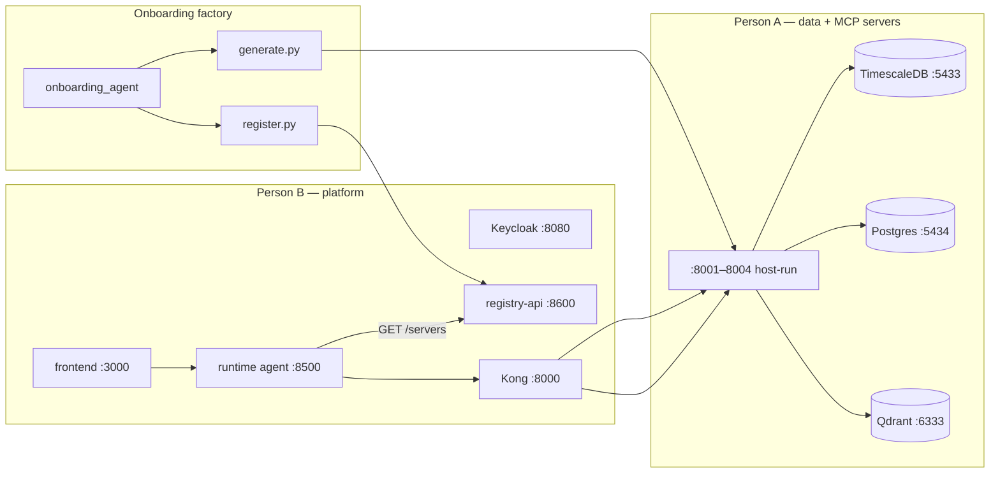

# Implementation & Setup Guide — Person A (Data & Backend)

How to clone this repo on a **fresh machine** and bring the data layer + MCP servers up.
Works for macOS/Linux (bash/zsh) and Windows (PowerShell). For a feature-by-feature
reference of the backend itself, see [`backend/README.md`](../backend/README.md); for the
project overview and architecture, see [`README.md`](../README.md).

> **Read this first — three things are NOT in the repo by design** and must be recreated locally:
> 1. `.env` (gitignored — copy from `.env.example`)
> 2. `infra/synthea/synthea-with-dependencies.jar` (gitignored, 188 MB — downloaded)
> 3. `infra/synthea/output/` (generated by the loader)
>
> Also: **the code is on the `person-a/phase-2` branch, not `main`.**

### Architecture (runtime + onboarding bridge)

Full diagrams: [`README.md`](../README.md) · [`ONBOARDING_RUNTIME_BRIDGE.md`](ONBOARDING_RUNTIME_BRIDGE.md)



---

## 0. Prerequisites

| Tool | Why | macOS / Linux | Windows (PowerShell) |
| --- | --- | --- | --- |
| Git | clone | `brew install git` | `winget install Git.Git` |
| uv | Python/venv manager (fetches Python 3.12) | `brew install uv` | `winget install astral-sh.uv` |
| Docker Desktop | data stores | `brew install --cask docker` | `winget install Docker.DockerDesktop` |
| Java 17 | run Synthea | `brew install openjdk@17` | `winget install Microsoft.OpenJDK.17` |

After installing, **launch Docker Desktop** (the daemon must be running) and **reopen your
terminal** so `PATH` updates. Verify Java: `java -version` → `17.x`.

> Windows alternative: `wsl --install` (WSL2 + Ubuntu), then use the macOS/Linux commands
> verbatim inside WSL. Docker Desktop integrates with WSL2 automatically.

---

## 1. Clone and switch to the code branch

```bash
git clone https://github.com/aakash-p-s/MCP-Data-Factory.git
cd MCP-Data-Factory
git checkout person-a/phase-2          # <-- main has docs only; code is here
```

## 2. Configure secrets (`.env`)

**macOS / Linux**
```bash
cp .env.example .env        # then edit passwords
```
**Windows**
```powershell
Copy-Item .env.example .env
notepad .env
```
Set `TIMESCALE_PASSWORD` / `CLINICAL_PASSWORD`. Default ports: Timescale **5433**,
Postgres **5434**, Qdrant **6333**, MCP servers **8001–8004**. If a port is taken, change it in `.env`.

## 3. Python environment

```bash
uv venv --python 3.12
uv pip install -r requirements.txt     # or: uv pip sync requirements.lock  (exact pins)
uv run python -c "import fastapi, mcp, qdrant_client, asyncpg, jwt; print('imports OK')"
```

## 4. Data stores (Docker)

```bash
docker compose up -d
docker compose ps                                    # wait for "healthy"
docker exec timescaledb-vitals psql -U postgres -d vitals   -c "\dt"
docker exec postgres-clinical  psql -U postgres -d clinical -c "\dt"
```
Schemas auto-load on first init. To re-apply after editing a `.sql`:
`docker compose down -v` then `up -d`.

Data stores only (split file): `docker compose -f docker-compose.data.yml up -d`

## 5. Synthetic data (Synthea)

### 5a. Download the jar (gitignored, 188 MB)

**macOS / Linux**
```bash
curl -sL -o infra/synthea/synthea-with-dependencies.jar \
  https://github.com/synthetichealth/synthea/releases/download/v4.0.0/synthea-with-dependencies.jar
```
**Windows** (use `curl.exe`, not `curl`)
```powershell
curl.exe -L -o infra/synthea/synthea-with-dependencies.jar `
  https://github.com/synthetichealth/synthea/releases/download/v4.0.0/synthea-with-dependencies.jar
```
Confirm it's ~180–190 MB (not a few KB) and runnable: `java -jar infra/synthea/synthea-with-dependencies.jar --help`.

### 5b. Load `.env` into the shell, then run the loader

**macOS / Linux**
```bash
set -a; . ./.env; set +a
uv run python infra/synthea/load_patients.py
```
**Windows** (PowerShell equivalent of `set -a; . ./.env`)
```powershell
Get-Content .env | Where-Object { $_ -match '^\s*[^#].*=' } | ForEach-Object {
    $name, $value = $_ -split '=', 2
    [Environment]::SetEnvironmentVariable($name.Trim(), $value.Trim())
}
uv run python infra/synthea/load_patients.py
```
Verify: `docker exec timescaledb-vitals psql -U postgres -d vitals -c "SELECT count(*) FROM vitals;"`.

Same `SYNTHEA_SEED=42` → same patients → `demo_patient_aliases.json` resolves to the same
UUIDs across machines.

### (Optional) Clinical notes → Qdrant (opt in early)

The `clinical_notes_search` MCP server is scheduled for **Jul 6**, but you can **load
the note data into Qdrant now** so the vector store is ready to browse. Skipped by
default; first run downloads the `all-MiniLM-L6-v2` embedding model (~80 MB).

**Why opt in early?**

- **Complete the data picture locally.** Phases 0–3 populate vitals, labs, diagnoses,
  and meds in SQL, but Qdrant stays empty unless you enable this step. Early load means
  all four domains have synthetic data on your machine — not just three.
- **Inspect notes before the search API exists.** You can open the Qdrant dashboard and
  read real physician-note payloads (`patient_id`, `note_date`, `text`) tied to the same
  `demo-patient-*` aliases as the SQL tables — useful for understanding what the Jul 6
  `clinical_notes_search` server will query.
- **Prove the embedding pipeline end-to-end.** Confirms Synthea's clinical-note export,
  `embeddings.py`, and Qdrant upsert all work on your OS (including the model download
  and the collection fingerprint guard) before you build `vector_connector.py`.
- **Unblock Jul 6 work.** When the vector connector and MCP server land, the
  `clinical_notes` collection is already populated — you only wire up query logic, not
  regenerate embeddings from scratch.
- **Still optional by default.** Phase 0–3 stays fast without it (~2 min loader vs extra
  time for model download + ~900 note embeddings). Enable when you care about notes,
  not because the stub `vitals_trends` server requires them.

**macOS / Linux** — load `.env`, then re-run the loader with notes enabled:

```bash
set -a; . ./.env; set +a
LOAD_NOTES=true uv run python infra/synthea/load_patients.py
```

**Windows** (PowerShell):

```powershell
cd c:\Users\Bhavna\Desktop\data_factory

Get-Content .env | Where-Object { $_ -match '^\s*[^#].*=' } | ForEach-Object {
    $name, $value = $_ -split '=', 2
    [Environment]::SetEnvironmentVariable($name.Trim(), $value.Trim())
}

$env:LOAD_NOTES="true"
uv run python infra/synthea/load_patients.py
```

> `cd` to your own clone path if different.

Verify notes landed (expect `clinical_notes` with hundreds of points; id `0` is the
model fingerprint, not a real note):

```bash
curl -s http://localhost:6333/collections/clinical_notes | jq .result.points_count   # macOS/Linux
```
```powershell
curl.exe -s http://localhost:6333/collections/clinical_notes
# -> "points_count": hundreds  (one chunk per encounter note + 1 fingerprint for seed=42 / 31 patients)
```

Browse payloads in the Qdrant dashboard: http://localhost:6333/dashboard

> The embedding model is defined once in [`backend/shared/embeddings.py`](../backend/shared/embeddings.py)
> (imported by both the loader and the future `vector_connector.py`), so the load-time and
> query-time models can never drift. Nothing to configure — it travels with the repo.

## 6. MCP servers (all 4 live)

Data stores must be running (Section 4). For notes, load Qdrant first:
`LOAD_NOTES=true uv run python infra/synthea/load_patients.py`

Start each server in its own terminal:

```bash
uv run python backend/servers/vitals_trends/main.py              # -> :8001/mcp  mcp.vitals.read
uv run python backend/servers/labs_diagnoses/main.py             # -> :8002/mcp  mcp.labs.read
uv run python backend/servers/medications_interactions/main.py   # -> :8003/mcp  mcp.meds.read
uv run python backend/servers/clinical_notes_search/main.py      # -> :8004/mcp  mcp.notes.read
```

| Server | Tools | Scope | Kong route |
| --- | --- | --- | --- |
| vitals_trends | `get_vitals_trend`, `compute_news2_score`, `list_abnormal_vitals` | `mcp.vitals.read` | `/mcp/clinical/vitals-trends/dev` |
| labs_diagnoses | `get_lab_trend`, `get_active_diagnoses`, `get_diagnosis_history` | `mcp.labs.read` | `/mcp/clinical/labs-diagnoses/dev` |
| medications_interactions | `get_active_medications`, `check_drug_interactions`, `get_polypharmacy_risk` | `mcp.meds.read` | `/mcp/clinical/medications-interactions/dev` |
| clinical_notes_search | `semantic_search_notes`, `get_recent_notes`, `get_notes_by_type` | `mcp.notes.read` | `/mcp/clinical/clinical-notes-search/dev` |

Each server banner confirms DB-backed mode, MCP SDK version, health URL, scope, and route.
Missing-scope or disallowed-role token → `403`. No bearer → `401` (set `AUTH_ALLOW_ANONYMOUS=true` for local POC).
See [`MCP_SERVERS.md`](MCP_SERVERS.md) for tool-call examples.

---

## Updating an existing clone (your other machine)

Already set up once? Don't redo the above — just pull the latest. All config (embedding
model pin, schemas, MCP servers, platform files) travels with the repo.

```bash
git pull                                  # on the person-a/phase-2 branch
```
```powershell
git pull                                  # Windows is identical
```

Only re-run a step if its *inputs* changed:
- **Dependencies changed** (`requirements.txt`) → `uv pip install -r requirements.txt`
- **Schema `.sql` changed** (including `seed-interaction-rules.sql`) → `docker compose down -v && up -d`
- **Loader changed / want fresh data** → re-run the loader (Section 5)
- **New MCP servers shipped** → start the new server(s) (Section 6); no data reload needed unless the loader changed

Optional — make clinical notes searchable in Qdrant on this machine too (model auto-downloads):

```bash
LOAD_NOTES=true uv run python infra/synthea/load_patients.py            # macOS / Linux
```
```powershell
$env:LOAD_NOTES="true"; uv run python infra/synthea/load_patients.py    # Windows
```

---

## Gotchas checklist

| Item | Why it bites |
| --- | --- |
| `git checkout person-a/phase-2` | `main` has no code yet, only docs |
| `cp` / `Copy-Item` `.env.example .env` | `.env` is gitignored; nothing runs without it |
| Launch Docker Desktop first | daemon must run before `docker compose` |
| Download the Synthea jar | gitignored (188 MB); loader exits with instructions if missing |
| Install Java 17 | Synthea is a Java tool; loader fails without it |
| Load `.env` before the loader | it reads `VITALS_DB_URL` / `CLINICAL_DB_URL` from the environment |
| Windows: `curl.exe`, not `curl` | PowerShell aliases `curl` to `Invoke-WebRequest` |
| Windows: re-run the `.env` block per new window | the variables are session-scoped |
| `LOAD_NOTES=true` before the loader | only needed if you want clinical notes in Qdrant early |
| `AUTH_ALLOW_ANONYMOUS=true` | local POC without Bearer tokens (default requires auth) |
| `AUTH_VERIFY_SIGNATURE=true` | full JWKS verify once Keycloak scp mapping is wired |
| Browse SQL / notes in the browser | optional — see [`DATA_CHECKING.md`](DATA_CHECKING.md) |
