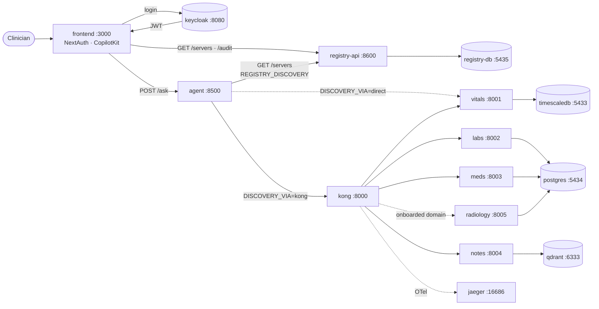
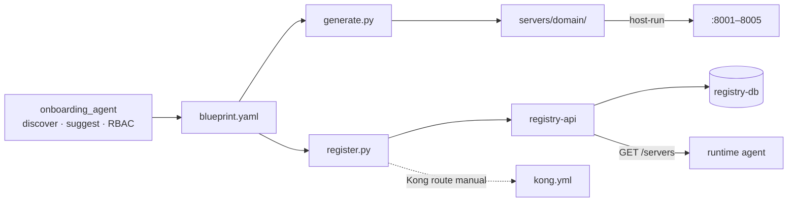

# Infrastructure — Docker Services, Roles & Flow

Everything runs as containers in **`docker-compose.yml`** (Jul 8 merge of the two halves below).
Split files remain for partial runs:

- **`docker-compose.yml`** — full stack (preferred): `docker compose up -d`
- **`docker-compose.data.yml`** — data stores only
- **`docker-compose.platform.yml`** — gateway/identity/registry only

Companion: [`MCP_SERVERS.md`](MCP_SERVERS.md) (the servers that sit between Kong and the data).

---

## Service map

| Service | Compose | Host port | Role | Config file |
| --- | --- | --- | --- | --- |
| **timescaledb-vitals** | data | 5433 | time-series store for vitals | `infra/postgres/init-timescale-vitals.sql` |
| **postgres-clinical** | data | 5434 | labs, diagnoses, medications | `infra/postgres/init-labs-diagnoses.sql`, `init-medications.sql` |
| **qdrant** | data | 6333 | vector store for clinical notes | (collection created by the loader) |
| **pgadmin** | data | 5050 | browse the SQL DBs (optional) | — |
| **keycloak** | platform | 8080 | identity provider — issues JWTs | `infra/keycloak/realm-export.json` |
| **kong** | platform | 8000 (proxy) / 8101 (admin) | API gateway — Layer-1 auth, routing, rate-limit | `infra/kong/kong.yml` |
| **registry-db** | platform | 5435 | control-plane source of truth (12 tables) | `infra/postgres/init-registry-db.sql` |
| **registry-api** | platform | 8600 | reads/writes registry-db; token-protected | `backend/registry/` |
| **jaeger** | platform | 16686 | distributed tracing UI | — |
| *agent, frontend* | platform (`full`) | 8500, 3000 | Runtime agent + clinician UI | `agent/`, `frontend/` |

---

## How it fits together (runtime path)



## Build-time path (onboarding → runtime bridge)



**Two security layers:** Kong is **Layer 1** (is the token *valid*? not over quota? route it).
Each MCP server is **Layer 2** (does this token's `scp` allow *this tool*?). Both must pass.

---

## Data stores (Person A)

### timescaledb-vitals — `:5433`
TimescaleDB = PostgreSQL 16 + a time-series extension. The `vitals` table is a **hypertable**
(auto-partitioned by time) so "last N hours" queries are fast. Read by `SQLConnector` via
`VITALS_DB_URL`. Schema auto-loads on first container init.

### postgres-clinical — `:5434`
Plain PostgreSQL 16 holding **`labs`, `diagnoses`, `medications`, `interaction_rules`** in one
`clinical` database. The `interaction_rules` table is seeded from
`infra/postgres/seed-interaction-rules.sql` on first init (curated RxNorm demo pairs).
Read via `CLINICAL_DB_URL`.

### qdrant — `:6333`
Vector database for clinical notes. The loader embeds notes with `all-MiniLM-L6-v2` and upserts
them into the `clinical_notes` collection (plus a fingerprint point so a model mismatch is caught
loudly — see `backend/shared/embeddings.py`). Dashboard at http://localhost:6333/dashboard.

```bash
docker compose up -d
docker compose ps
docker exec timescaledb-vitals psql -U postgres -d vitals   -c "\dt"
docker exec postgres-clinical  psql -U postgres -d clinical -c "\dt"
```

Partial stack (legacy split files):

```bash
docker compose -f docker-compose.data.yml up -d
docker compose -f docker-compose.platform.yml up -d
```

---

## Platform services (Person B)

### keycloak — `:8080` (identity provider)
Issues OAuth2/OIDC JWTs for the realm **`patient-risk`** with 3 roles
(`clinical-viewer`, `physician`, `case-manager`). Config is `infra/keycloak/realm-export.json`,
imported on first start.

> **Static signing key (fix applied):** the realm pins a **static RSA KeyProvider** (`rsa-static`)
> so Keycloak signs with the same key across every re-init — otherwise Kong's pinned public key
> goes stale and you get `401 Invalid signature`. The matching public key lives in `kong.yml`.
> The two files must change together (a note in each says so).

```bash
# get a token
curl -s -X POST http://localhost:8080/realms/patient-risk/protocol/openid-connect/token \
  -d grant_type=client_credentials -d client_id=patient-risk-agent \
  -d client_secret=agent-secret-change-in-prod
```

### kong — `:8000` proxy / `:8101` admin (API gateway, Layer 1)
Declarative config `infra/kong/kong.yml` defines one **service + route per MCP server**. For each:
- a **jwt** plugin validates the token signature against the realm key (`key_claim_name: iss`),
- a **rate-limiting** plugin (60/min vitals & labs, 30/min meds & notes),
- vitals also has a **request-transformer** rewriting the path to `/mcp` for the upstream.

Kong reaches the host-run MCP servers via `host.docker.internal:<port>`.

```bash
curl -s http://localhost:8101/routes | python3 -m json.tool | grep '"paths"'   # loaded routes
# tokenless call -> 401 (route wired + JWT enforced); unknown path -> 404
```

### registry-db — `:5435` (control plane)
PostgreSQL holding the **12 control-plane tables** (`products`, `mcp_servers`, `tool_specs`,
`rbac_mappings`, `gateway_routes`, `audit_events`, `health_checks`, …) — the system's source of
truth for "what servers exist and how they're reached." Schema: `infra/postgres/init-registry-db.sql`.

### registry-api — `:8600`
FastAPI over registry-db (`backend/registry/`). `GET /servers`, `/audit`, etc. Its `auth.py`
**requires a valid Keycloak token** on every request (non-anonymous) — `/docs` is open, `/servers`
returns 401 without a token.

### jaeger — `:16686`
Receives OpenTelemetry traces (one trace id per question across all hops). UI at :16686.

```bash
docker compose up -d        # keycloak, kong, registry-db, registry-api, jaeger (+ data stores)
docker compose --profile full up -d   # + agent, frontend (when uploaded)
```

---

## Full green-path test (token → Kong → server → FHIR)

```bash
# data stores + platform + the four MCP servers (host)
docker compose up -d
uv run python backend/servers/vitals_trends/main.py &
uv run python backend/servers/labs_diagnoses/main.py &
uv run python backend/servers/medications_interactions/main.py &
uv run python backend/servers/clinical_notes_search/main.py &

TOK=$(curl -s -X POST http://localhost:8080/realms/patient-risk/protocol/openid-connect/token \
  -d grant_type=client_credentials -d client_id=patient-risk-agent \
  -d client_secret=agent-secret-change-in-prod | python3 -c "import sys,json;print(json.load(sys.stdin)['access_token'])")

for route in vitals-trends labs-diagnoses medications-interactions clinical-notes-search; do
  curl -s -o /dev/null -w "$route %{http_code}\n" \
    "http://localhost:8000/mcp/clinical/$route/dev" -X POST \
    -H "Authorization: Bearer $TOK" -H "Accept: application/json, text/event-stream" \
    -H "Content-Type: application/json" -d '{"jsonrpc":"2.0","id":1,"method":"tools/list"}'
done
# each -> 200  (signature + host header + route all good)
```

## Re-initialising / resetting

```bash
# data: drop volumes to re-run schemas from scratch
docker compose down -v && docker compose up -d

# platform only: re-import Keycloak realm (after realm-export.json change)
docker compose stop keycloak
docker volume rm data_factory_keycloak_data 2>/dev/null || docker volume rm $(docker volume ls -q | grep keycloak_data | head -1)
docker compose up -d keycloak kong registry-db registry-api
```

> Port reference: data → 5433/5434/6333 (+5050); platform → 8080/8000/8101/5435/8600/16686;
> MCP servers → 8001/8002/8003/8004. No host clashes between the two compose files.
