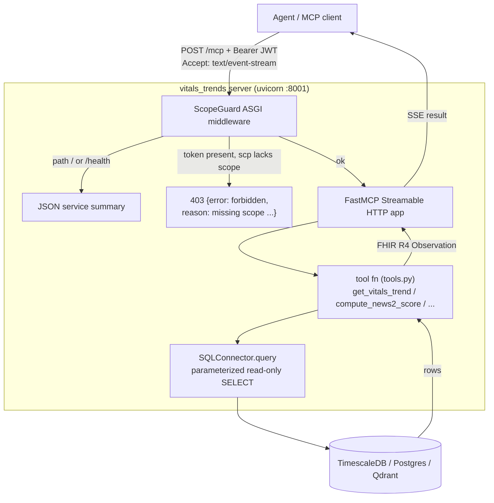

# MCP Servers — How Each One Is Built

The four MCP servers are the heart of Person A's deliverable. Each exposes a small set of
**tools** an agent can call over the Model Context Protocol (MCP), returns **FHIR R4**
resources, and enforces **Layer-2 scope checks**. All four are generated from the same
hardened template — only the domain, tools, connector, and storage differ.

| Doc | For |
| --- | --- |
| this file | how a server is structured + how to build/run/test one |
| [`INFRASTRUCTURE.md`](INFRASTRUCTURE.md) | Kong, Keycloak, the databases (what they do) |
| [`HANDOVER_PERSON_B.md`](HANDOVER_PERSON_B.md) | the frozen integration contract |

---

## The four servers

| Server | Tools | Scope | Kong route | Storage | FHIR resource | Status |
| --- | --- | --- | --- | --- | --- | --- |
| **vitals_trends** | `get_vitals_trend`, `compute_news2_score`, `list_abnormal_vitals` | `mcp.vitals.read` | `/mcp/clinical/vitals-trends/dev` | TimescaleDB | `Observation` | ✅ DB-backed |
| **labs_diagnoses** | `get_lab_trend`, `get_active_diagnoses`, `get_diagnosis_history` | `mcp.labs.read` | `/mcp/clinical/labs-diagnoses/dev` | Postgres | `Observation`, `Condition` | ⏳ Jun 30 |
| **medications_interactions** | `get_active_medications`, `check_drug_interactions`, `get_polypharmacy_risk` | `mcp.meds.read` | `/mcp/clinical/medications-interactions/dev` | Postgres | `MedicationStatement` | ⏳ Jul 1 |
| **clinical_notes_search** | `semantic_search_notes`, `get_recent_notes`, `get_notes_by_type` | `mcp.notes.read` | `/mcp/clinical/clinical-notes-search/dev` | Qdrant | `DocumentReference` | ⏳ Jul 6 |

The three SQL servers share **`SQLConnector`**; `clinical_notes_search` uses **`VectorConnector`** —
the same `Connector` interface, proving the architecture is source-agnostic.

---

## Anatomy of a server

Each server lives in `backend/servers/<domain>/`:

```
backend/servers/vitals_trends/
├── main.py            # FastAPI/MCP app: registers tools, ScopeGuard, transport security
├── tools.py           # the tool functions: query the connector, FHIR-shape rows
├── news2.py           # domain logic (vitals only: NHS NEWS2 score)
├── blueprint.yaml     # the FROZEN contract (tools, scope, route, RBAC) — human-approval artifact
├── Dockerfile         # containerize the server
└── requirements.txt   # pinned deps (mcp==1.28, fastapi, pyjwt, psycopg)
```

Shared, imported by every server (the **Fixed Core**, `backend/shared/`):

| File | Role |
| --- | --- |
| `connector_base.py` | the `Connector` ABC (`connect/auth/schema/query`) every connector implements |
| `embeddings.py` | single-source embedding model + Qdrant fingerprint (notes server) |
| `auth.py` *(Jul 2)* | real JWT verify + group/scope RBAC |
| `audit.py`, `cache.py`, `egress_guard.py`, `telemetry.py` *(Jul 2)* | hardening |

And the connectors (`backend/connectors/`): `sql_connector.py`, `vector_connector.py` *(Jul 6)*.

---

## Request flow (what happens on a tool call)



- **ScopeGuard** (pure-ASGI, in `main.py`) runs first: serves `/` & `/health` summaries, emits
  the exact **403 envelope** when a bearer token lacks the scope, otherwise passes through.
- **FastMCP** turns each `@mcp.tool()` function into a discoverable MCP tool (reads type hints
  for the input schema, docstring for the description).
- **TransportSecuritySettings** allow-lists the `Host` header (so it works behind Kong without
  disabling DNS-rebinding protection).
- Tools call the **connector**, which runs a **parameterized read-only** query (write/DDL keywords
  are rejected — query guardrails §6.6), then FHIR-shape the rows.

---

## How `vitals_trends` was built (the reference example)

1. **`sql_connector.py`** — `SQLConnector(Connector)` over asyncpg. DSN bound at construction
   (egress-guard intent); `query()` enforces read-only.
2. **`news2.py`** — the published NHS NEWS2 scoring table (Scale 1), partial-input aware.
3. **`tools.py`** — three async functions that query the connector and build FHIR `Observation`s.
   `hours` is windowed relative to the patient's latest reading (Synthea data is historical).
4. **`main.py`** — creates `FastMCP("vitals_trends", transport_security=...)`, registers the three
   tools (each delegates to `tools.py` with the connector), wraps the app in `ScopeGuard`.

The Day-1 **stub** was the same `main.py` returning hardcoded FHIR; swapping in the connector
kept tool names / scope / route / FHIR shape / 403 identical — so the agent never noticed.

---

## Commands

Run the server (data stores must be up — see [`INFRASTRUCTURE.md`](INFRASTRUCTURE.md)):
```bash
uv run python backend/servers/vitals_trends/main.py     # -> http://localhost:8001/mcp
```
Banner: `[vitals_trends] DB-backed | MCP SDK 1.28.0 | health … | mcp … | scope=mcp.vitals.read`.

Browser-friendly health summary (no MCP client needed):
```bash
curl -s http://localhost:8001/health
```

Call a tool with an MCP client (direct):
```python
# uv run --with httpx python -
import anyio, jwt
from mcp.client.streamable_http import streamablehttp_client
from mcp.client.session import ClientSession
tok = jwt.encode({"scp": "mcp.vitals.read"}, "x"*32, algorithm="HS256")
async def go():
    async with streamablehttp_client("http://localhost:8001/mcp",
                                     headers={"Authorization": f"Bearer {tok}"}) as (r,w,_):
        async with ClientSession(r,w) as s:
            await s.initialize()
            print([t.name for t in (await s.list_tools()).tools])
            print(await s.call_tool("get_vitals_trend", {"patient_id":"<uuid>","hours":4380}))
anyio.run(go)
```

Test the **403** path (token missing the scope):
```bash
curl -s http://localhost:8001/mcp -X POST \
  -H "Authorization: Bearer $(python3 -c "import jwt;print(jwt.encode({'scp':'mcp.notes.read'},'x'*32,algorithm='HS256'))")" \
  -H "Accept: application/json, text/event-stream" -H "Content-Type: application/json" \
  -d '{"jsonrpc":"2.0","id":1,"method":"tools/list"}'
# -> 403 {"error":{"code":"forbidden","reason":"missing scope mcp.vitals.read"}}
```

Call **through Kong** (full path, needs a Keycloak token) — see [`INFRASTRUCTURE.md`](INFRASTRUCTURE.md).

---

## Adding the next server (labs/meds/notes)

1. Copy `vitals_trends/` to `backend/servers/<domain>/`.
2. Write `blueprint.yaml` with the domain's tools, scope, Kong route (from the contract).
3. Write `tools.py` querying the right tables; build the right FHIR resource
   (`Condition` for diagnoses, `MedicationStatement` for meds, `DocumentReference` for notes).
4. SQL domains reuse `SQLConnector(CLINICAL_DB_URL)`; the notes server uses `VectorConnector`
   (`from backend.shared.embeddings import embed, assert_model_matches, exclude_meta_filter`).
5. Pick a port (8002/8003/8004), wire it into Kong's upstream, register in `registry-db`.
6. Keep the **contract frozen** — tell Person B same-day if a tool name / scope / route changes.
