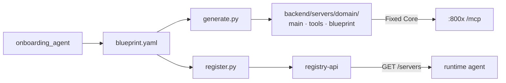
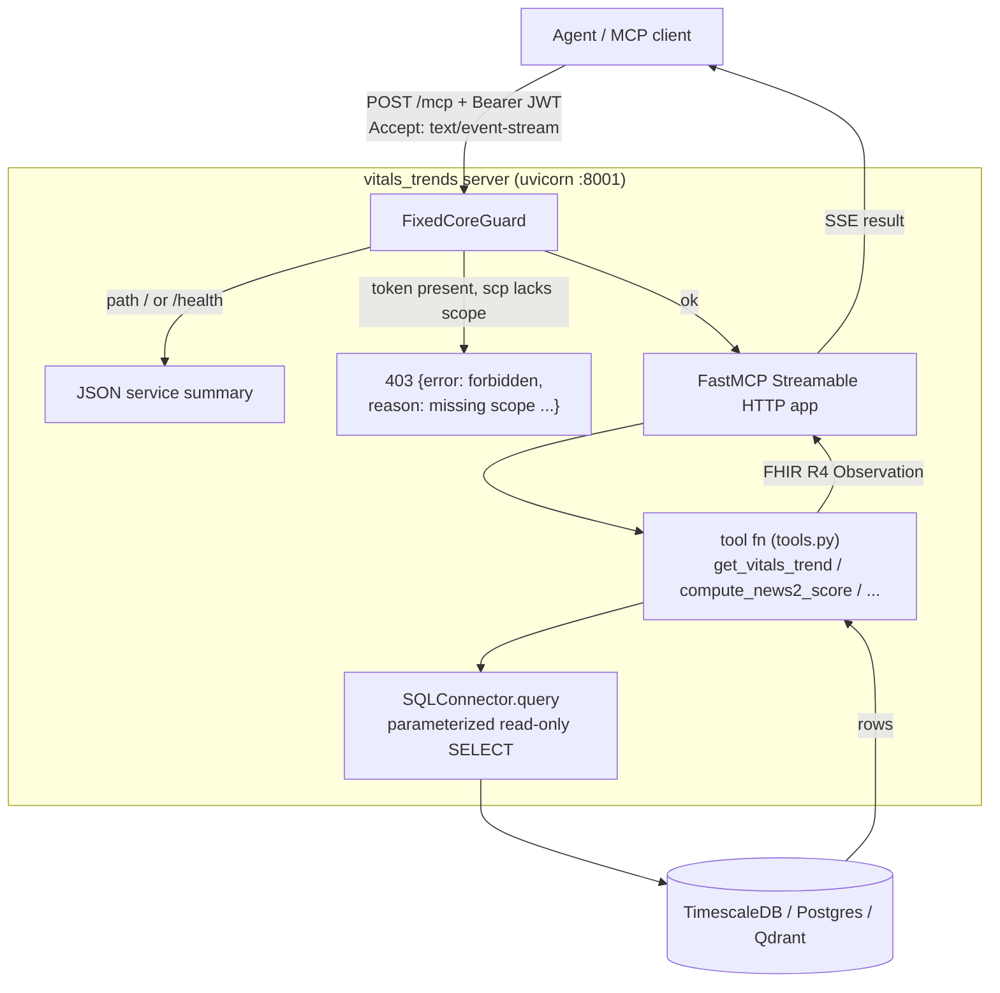

# MCP Servers — How Each One Is Built

The four MCP servers are the heart of Person A's deliverable. Each exposes a small set of
**tools** an agent can call over the Model Context Protocol (MCP), returns **FHIR R4**
resources, and enforces **Layer-2 scope checks**. All four are generated from the same
hardened template — only the domain, tools, connector, and storage differ.

| Doc | For |
| --- | --- |
| this file | how a server is structured + how to build/run/test one |
| [`INFRASTRUCTURE.md`](INFRASTRUCTURE.md) | Kong, Keycloak, the databases (what they do) |
| [`HANDOVER_PERSON_B.md`](HANDOVER_PERSON_B.md) | the frozen integration contract |

---

## The four servers

| Server | Tools | Scope | Kong route | Storage | FHIR resource | Status |
| --- | --- | --- | --- | --- | --- | --- |
| **vitals_trends** | `get_vitals_trend`, `compute_news2_score`, `list_abnormal_vitals` | `mcp.vitals.read` | `/mcp/clinical/vitals-trends/dev` | TimescaleDB | `Observation` | ✅ DB-backed |
| **labs_diagnoses** | `get_lab_trend`, `get_active_diagnoses`, `get_diagnosis_history` | `mcp.labs.read` | `/mcp/clinical/labs-diagnoses/dev` | Postgres | `Observation`, `Condition` | ✅ DB-backed |
| **medications_interactions** | `get_active_medications`, `check_drug_interactions`, `get_polypharmacy_risk` | `mcp.meds.read` | `/mcp/clinical/medications-interactions/dev` | Postgres | `MedicationStatement` | ✅ DB-backed |
| **clinical_notes_search** | `semantic_search_notes`, `get_recent_notes`, `get_notes_by_type` | `mcp.notes.read` | `/mcp/clinical/clinical-notes-search/dev` | Qdrant | `DocumentReference` | ✅ DB-backed |

The three SQL servers share **`SQLConnector`**; `clinical_notes_search` uses **`VectorConnector`** —
the same `Connector` interface, proving the architecture is source-agnostic.

New domains (e.g. **`radiology_reports` :8005**) are generated by the onboarding factory —
see [`ONBOARDING_RUNTIME_BRIDGE.md`](ONBOARDING_RUNTIME_BRIDGE.md).

---

## Onboarding factory flow (new domains)



---

## Anatomy of a server

Each server lives in `backend/servers/<domain>/`:

```
backend/servers/vitals_trends/
├── main.py            # FastMCP app + FixedCoreGuard + transport security
├── tools.py           # the tool functions: query the connector, FHIR-shape rows
├── news2.py           # domain logic (vitals only: NHS NEWS2 score)
├── blueprint.yaml     # the FROZEN contract (tools, scope, route, RBAC) — human-approval artifact
├── Dockerfile         # containerize the server
└── requirements.txt   # pinned deps (mcp==1.28, fastapi, pyjwt, psycopg)
```

Shared, imported by every server (the **Fixed Core**, `backend/shared/`):

| File | Role |
| --- | --- |
| `connector_base.py` | the `Connector` ABC (`connect/auth/schema/query`) every connector implements |
| `embeddings.py` | single-source embedding model + Qdrant fingerprint (notes server) |
| `auth.py` | JWT verify + group/scope RBAC (Layer 2) |
| `audit.py` | structured audit + `purpose_of_access` enum |
| `middleware.py` | shared `FixedCoreGuard` ASGI wrapper (replaces per-server ScopeGuard) |
| `egress_guard.py` | locked connector DSN per server |
| `cache.py` | 30s TTL decorator for read-heavy tools |
| `self_healing.py` | tenacity retry + pool/client reset on transient errors |

And the connectors (`backend/connectors/`): `sql_connector.py`, `vector_connector.py`.

---

## Request flow (what happens on a tool call)



- **FixedCoreGuard** (pure-ASGI, `backend/shared/middleware.py`) runs first: serves `/` & `/health`
  summaries, verifies JWT via `auth.py`, enforces scope + group RBAC, audits auth decisions.
  Missing/invalid token → **401**; wrong scope or role → **403** with explain-denial envelope.
  Each tool call additionally audits PHI access via `audit_phi()` (reads `X-Purpose-Of-Access`).
- **FastMCP** turns each `@mcp.tool()` function into a discoverable MCP tool (reads type hints
  for the input schema, docstring for the description).
- **TransportSecuritySettings** allow-lists the `Host` header (so it works behind Kong without
  disabling DNS-rebinding protection).
- Tools call the **connector**, which runs a **parameterized read-only** query (write/DDL keywords
  are rejected — query guardrails §6.6), then FHIR-shape the rows.

---

## How `vitals_trends` was built (the reference example)

1. **`sql_connector.py`** — `SQLConnector(Connector)` over asyncpg. DSN bound at construction
   (egress-guard intent); `query()` enforces read-only.
2. **`news2.py`** — the published NHS NEWS2 scoring table (Scale 1), partial-input aware.
3. **`tools.py`** — three async functions that query the connector and build FHIR `Observation`s.
   `hours` is windowed relative to the patient's latest reading (Synthea data is historical).
4. **`main.py`** — creates `FastMCP("vitals_trends", transport_security=...)`, registers the three
   tools (each delegates to `tools.py` with the locked connector), wraps in `FixedCoreGuard`.

The Day-1 **stub** was the same `main.py` returning hardcoded FHIR; swapping in the connector
kept tool names / scope / route / FHIR shape / 403 identical — so the agent never noticed.

---

## Commands

Run a server (data stores must be up — see [`INFRASTRUCTURE.md`](INFRASTRUCTURE.md)):

```bash
uv run python backend/servers/vitals_trends/main.py              # -> http://localhost:8001/mcp
uv run python backend/servers/labs_diagnoses/main.py             # -> http://localhost:8002/mcp
uv run python backend/servers/medications_interactions/main.py   # -> http://localhost:8003/mcp
uv run python backend/servers/clinical_notes_search/main.py      # -> http://localhost:8004/mcp
```

Each banner confirms Fixed Core mode, MCP SDK version, health URL, scope, and Kong route.
Notes server needs Qdrant populated first (`LOAD_NOTES=true` when running `load_patients.py`).

Browser-friendly health summary (no MCP client needed):
```bash
curl -s http://localhost:8001/health
```

Call a tool with an MCP client (direct):
```python
# uv run --with httpx python -
import anyio, jwt
from mcp.client.streamable_http import streamablehttp_client
from mcp.client.session import ClientSession
tok = jwt.encode({"scp": "mcp.vitals.read"}, "x"*32, algorithm="HS256")
async def go():
    async with streamablehttp_client("http://localhost:8001/mcp",
                                     headers={"Authorization": f"Bearer {tok}"}) as (r,w,_):
        async with ClientSession(r,w) as s:
            await s.initialize()
            print([t.name for t in (await s.list_tools()).tools])
            print(await s.call_tool("get_vitals_trend", {"patient_id":"<uuid>","hours":4380}))
anyio.run(go)
```

Test the **403** path (token missing the scope):
```bash
curl -s http://localhost:8001/mcp -X POST \
  -H "Authorization: Bearer $(python3 -c "import jwt;print(jwt.encode({'scp':'mcp.notes.read'},'x'*32,algorithm='HS256'))")" \
  -H "Accept: application/json, text/event-stream" -H "Content-Type: application/json" \
  -d '{"jsonrpc":"2.0","id":1,"method":"tools/list"}'
# -> 403 {"error":{"code":"forbidden","reason":"missing scope mcp.vitals.read"}}
```

Call **through Kong** (full path, needs a Keycloak token) — see [`INFRASTRUCTURE.md`](INFRASTRUCTURE.md).

---

## How `labs_diagnoses` was built

Same template as `vitals_trends`, but over **`CLINICAL_DB_URL`** (Postgres `:5434`):

1. **`tools.py`** — three async functions querying `labs` and `diagnoses`; FHIR-shape as
   `Observation` (labs) and `Condition` (diagnoses).
2. **`main.py`** — `FastMCP("labs_diagnoses")`, registers tools, `FixedCoreGuard` with
   `mcp.labs.read` and `ALLOWED_GROUPS = {grp-clinical-viewer, grp-physician}` (case-manager
   denied per blueprint).
3. **`blueprint.yaml`** — frozen contract; Kong route `/mcp/clinical/labs-diagnoses/dev`.

Test the **403** path (case-manager group denied even with scope):
```bash
curl -s http://localhost:8002/mcp -X POST \
  -H "Authorization: Bearer $(python3 -c "import jwt;print(jwt.encode({'scp':'mcp.labs.read','groups':['grp-case-manager']},'x'*32,algorithm='HS256'))")" \
  -H "Accept: application/json, text/event-stream" -H "Content-Type: application/json" \
  -d '{"jsonrpc":"2.0","id":1,"method":"tools/list"}'
# -> 403 role not permitted ...
```

---

## How `medications_interactions` was built

Same template, Postgres `:5434`, plus a curated **`interaction_rules`** reference table:

1. **`infra/postgres/seed-interaction-rules.sql`** — six RxNorm pairs (e.g. lisinopril +
   naproxen on `demo-patient-1`); auto-seeded on first Postgres init.
2. **`interactions.py`** — `check_pairs()` queries rules symmetrically (unordered pairs).
3. **`tools.py`** — `get_active_medications` → FHIR `MedicationStatement`;
   `check_drug_interactions` → rule hits; `get_polypharmacy_risk` → 5+ active meds = elevated.
4. **`main.py`** — scope `mcp.meds.read`, **`ALLOWED_GROUPS = {grp-physician}` only**
   (clinical-viewer and case-manager denied — physician-only domain).

> **Illustrative rule set only** — not a licensed clinical drug-interaction database.

---

## How `clinical_notes_search` was built

The vector server proves the **same Connector interface** works for Qdrant:

1. **`vector_connector.py`** — `VectorConnector(Connector)` over `AsyncQdrantClient`. URL fixed
   at construction via `locked_connector_for()`. On connect, calls `assert_model_matches()` so
   a loader/connector embedding mismatch crashes loudly.
2. **`tools.py`** — three query modes via `conn.query()`:
   - `search` — embed the query text, cosine similarity within `patient_id`
   - `recent` — scroll + sort by `note_date` desc
   - `by_type` — filter on `note_type` payload (e.g. `physician_note`)
   FHIR-shape rows as `DocumentReference` (note text in `description` + `text`).
3. **`main.py`** — scope `mcp.notes.read`, **`ALLOWED_GROUPS = {grp-physician, grp-case-manager}`**
   (clinical-viewer denied per blueprint). `@cached(30)` on `get_recent_notes`.

Test the **403** path (nurse denied notes):
```bash
curl -s http://localhost:8004/mcp -X POST \
  -H "Authorization: Bearer $(python3 -c "import jwt;print(jwt.encode({'scp':'mcp.notes.read','groups':['grp-clinical-viewer']},'x'*32,algorithm='HS256'))")" \
  -H "Accept: application/json, text/event-stream" -H "Content-Type: application/json" \
  -d '{"jsonrpc":"2.0","id":1,"method":"tools/list"}'
# -> 403 role not permitted ...
```

---

## Architecture note (SQL vs vector)

Three domains use **`SQLConnector`** (parameterized SELECT over Postgres/TimescaleDB).
`clinical_notes_search` uses **`VectorConnector`** (cosine similarity + payload scroll over Qdrant).
Both implement the same `Connector` ABC — the agent sees identical MCP tool patterns; only the
storage backend differs. Embedding model + collection name live in **`backend/shared/embeddings.py`**
(single source of truth for loader and connector).
