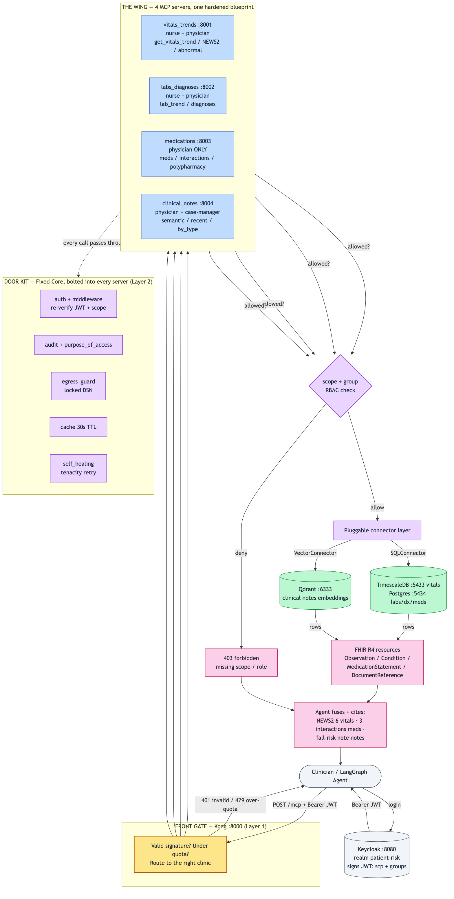
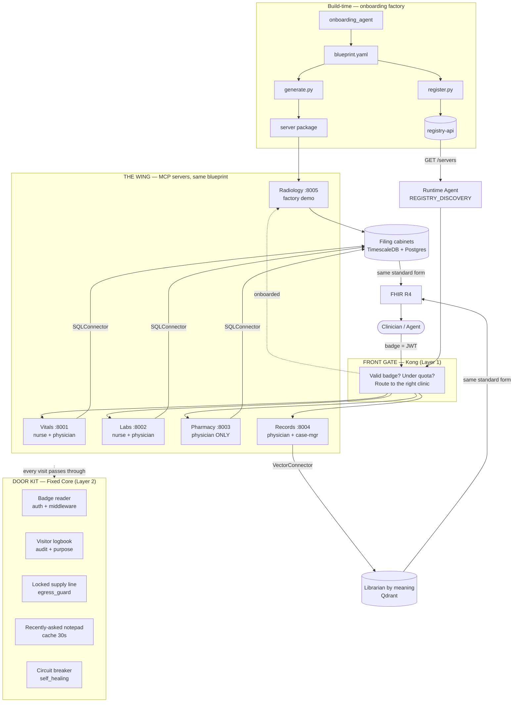

# Person A — One-Pager: Four Clinics, One Hardened Blueprint

> **The analogy:** I opened **four specialist clinics** inside one secure hospital wing
> (Vitals, Labs, Pharmacy, Records Room). Instead of hand-building each, I designed **one
> tamper-proof blueprint** — a security fit-out kit bolted into every room — and stamped it
> four times. Two security checkpoints guard the wing; every clinic answers on the same
> standardized medical form (FHIR R4).

> PNG: [`workflow.png`](workflow.png) · editable source: [`workflow.mmd`](workflow.mmd)
> (re-render with `npx -y @mermaid-js/mermaid-cli -i docs/workflow.mmd -o docs/workflow.png -b white -s 2`).

## Build — one blueprint, stamped four times

| Step | Clinic analogy | In the code |
| --- | --- | --- |
| 1. Supply line | run a locked pipe to one storeroom | `sql_connector.py` / `vector_connector.py` (read-only, same `Connector` socket) |
| 2. Domain brain | the clinic's specialty knowledge | `news2.py` (real NHS score), `interactions.py` (RxNorm pairs) |
| 3. Services | what the clinic offers at the desk | `tools.py` → query + shape rows into FHIR |
| 4. Reception + door kit | open the desk, bolt in security | `main.py` (FastMCP) wrapped in `FixedCoreGuard` |
| 5. Frozen charter | signed notice on the wall | `blueprint.yaml` — tools, scope, route, RBAC (the contract) |

> **Show-room first:** Day 1 each clinic returned hardcoded FHIR; swapping in the real
> connector kept tool names, scope, route, FHIR shape, and 403 behavior **identical** — the
> agent never noticed mock → live.

## Test — commissioning before opening

| Inspection | Command | Result |
| --- | --- | --- |
| Bench tests (no servers) | `uv run pytest backend/tests/ -q` | **62 passing** (RBAC 4×3, Fixed Core, chaos drill) |
| Live "what do you offer?" | `python scripts/mcp_inspector_smoke.py` | **4/4 servers** |
| Full walkthrough on demo patient | `python scripts/pre_push_verify.py` | **14/14 checks** |
| Wrong-badge drills | `403` curls (nurse→notes, case-mgr→labs) | explained denial |
| One-command boot + verify + stop | `bash scripts/start_mcp_servers.sh --verify` | green path |

## Done — Person A sprint complete (Jun 28, 2026)

- ✅ 4 MCP servers live (`:8001–8004`, 12 tools), all DB-backed
- ✅ Fixed Core: auth · audit · egress guard · cache · middleware
- ✅ Self-healing connectors (tenacity)
- ✅ Two connector types proving source-agnostic design (SQL + Vector)
- ✅ Deterministic Synthea pipeline (v4.0.0, 31 patients, notes → Qdrant)
- ✅ RBAC matrix enforced + tested (77+ pytest) · unified `docker-compose.yml` · docs + scripts
- ✅ Person B complete: runtime agent, frontend, registry integration, LangSmith tracing
- ✅ Integrated live demo verified Jul 6, 2026

**In one line:** one hardened, tamper-proof blueprint → four independently-governed clinics →
two storeroom types → one standard form → two checkpoints → full platform with clinician UI,
proven safe with 77+ bench tests plus live walkthroughs.
