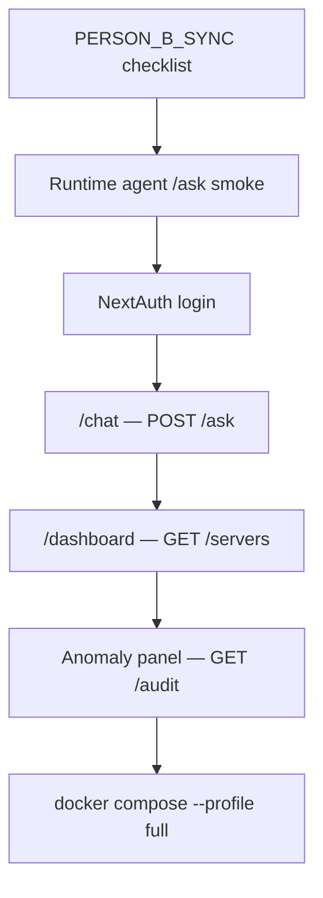
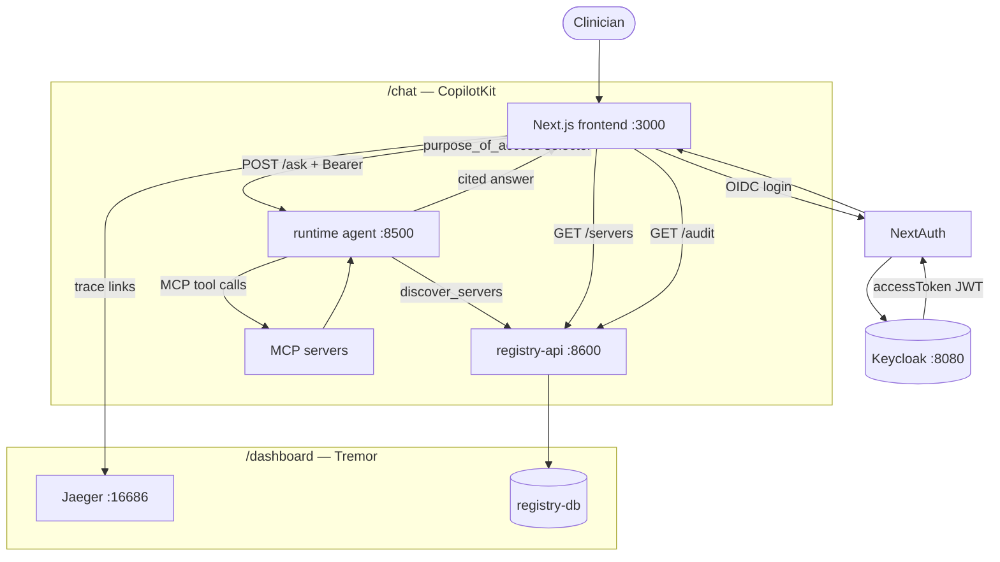

# Person B — Frontend Build Guide (Complete)

> **Status:** **Done** (Jul 6, 2026). The `frontend/` directory is built and verified end-to-end
> against the runtime agent, registry-api, and Keycloak. Wired into `docker-compose.platform.yml`
> under the `full` profile.
>
> **Person A + Person B delivery complete:** four MCP servers (+ radiology demo), Fixed Core,
> registry-db, runtime agent, and clinician UI. See [`troubleshooting.md`](troubleshooting.md)
> for the QA pass log and [`HANDOVER_PERSON_B.md`](HANDOVER_PERSON_B.md) for frozen contracts.

This document is the build spec for the **three UI surfaces** called out in the PRD:

| Surface | Route | Purpose |
| --- | --- | --- |
| **Chat** | `/chat` | Clinician asks a natural-language risk question |
| **Dashboard** | `/dashboard` | Control-plane overview — server health, usage KPIs |
| **Anomaly panel** | `/dashboard` (section) or `/dashboard/anomalies` | PHI access audit analytics — spikes, denials, suspicious patterns |

Companion docs (read these first):

- [`PERSON_B_SYNC.md`](PERSON_B_SYNC.md) — sync checklist before you write any UI code
- [`ONBOARDING_RUNTIME_BRIDGE.md`](ONBOARDING_RUNTIME_BRIDGE.md) — onboarding → runtime connections + testing
- [`HANDOVER_PERSON_B.md`](HANDOVER_PERSON_B.md) — frozen MCP contracts, RBAC matrix, Kong routes
- [`INFRASTRUCTURE.md`](INFRASTRUCTURE.md) — ports, compose profiles, Jaeger
- Codebase PRD §5.8 — canonical file tree and acceptance criteria
- Person B PRD — platform scope (Kong, Keycloak, agent, frontend)

---

## Platform deliverables (all complete)

| Deliverable | Location | Port | Status |
| --- | --- | --- | --- |
| Keycloak realm | `infra/keycloak/realm-export.json` | 8080 | Done |
| Kong gateway | `infra/kong/kong.yml` | 8000 | Done (5 routes; manual edit per new domain) |
| Registry DB + API | `backend/registry/` | 8600 | Done (live health polling) |
| Jaeger | `docker-compose.platform.yml` | 16686 | Done |
| Runtime agent | `agent/runtime_agent.py` | 8500 | Done — `/ask`, registry discovery, LangSmith |
| Onboarding agent | `backend/onboarding_agent/` | — | Done — CLI pipeline (`main.py` / `run.py`) |
| **Frontend** | `frontend/` | 3000 | **Done** — `/chat`, `/dashboard`, anomaly panel |

### Dependency order (recommended)



---

## Tech stack (frozen — do not substitute without team agreement)

| Layer | Choice | Notes |
| --- | --- | --- |
| Framework | **Next.js** (App Router) | `app/` directory layout |
| Styling | **Tailwind CSS** | `tailwind.config.ts` |
| Chat UI | **CopilotKit** | Wraps the clinical Q&A experience |
| Dashboard | **Tremor** | KPI cards, charts, tables |
| Auth | **NextAuth.js** | Keycloak as OIDC provider — §6.4.1 gap fix |
| Tracing | OpenTelemetry → Jaeger | Link trace IDs from audit rows to Jaeger UI |

Pin versions in `frontend/package.json`. The MCP SDK version is irrelevant here; the frontend
never speaks MCP directly — it calls the runtime agent and registry-api over HTTP.

### Frontend auth + data flow



---

## Directory structure to create

Matches Codebase PRD §4 / §5.8:

```
frontend/
├── package.json
├── tailwind.config.ts
├── tsconfig.json
├── next.config.js
├── Dockerfile
├── app/
│   ├── layout.tsx                 # shell: nav, session provider, theme
│   ├── page.tsx                   # redirect → /chat or /dashboard
│   ├── chat/
│   │   └── page.tsx               # CopilotKit chat (main clinician UX)
│   ├── dashboard/
│   │   └── page.tsx               # Tremor dashboard + anomaly panel section
│   └── api/
│       └── auth/
│           └── [...nextauth]/
│               └── route.ts       # NextAuth ↔ Keycloak OIDC
└── components/
    ├── ApprovalCard.tsx           # optional — human-in-the-loop blueprint review
    ├── RegistryTable.tsx          # live server status table
    ├── AnomalyPanel.tsx           # audit analytics (recommended split from dashboard page)
    ├── PurposeSelector.tsx        # 5-value purpose_of_access dropdown
    └── PatientPicker.tsx          # demo-patient-1 … demo-patient-31 aliases
```

---

## Authentication flow (must work before chat)

```
User → NextAuth (Keycloak OIDC login)
     → session.accessToken (JWT, shape §6.1)
     → Bearer header on:
         POST http://localhost:8500/ask          (runtime agent)
         GET  http://localhost:8600/servers      (registry-api)
         GET  http://localhost:8600/audit        (registry-api)
```

### Token claims the backend expects

```json
{
  "sub": "<user id>",
  "oid": "<object id>",
  "groups": ["grp-clinical-viewer" | "grp-physician" | "grp-case-manager"],
  "scp": "mcp.vitals.read mcp.labs.read ..."
}
```

### NextAuth / Keycloak config

Environment variables (already stubbed in `docker-compose.platform.yml`):

| Variable | Purpose |
| --- | --- |
| `NEXTAUTH_URL` | `http://localhost:3000` |
| `NEXTAUTH_SECRET` | Session signing — generate with `openssl rand -base64 32` |
| `KEYCLOAK_CLIENT_ID` | `patient-risk-agent` (or a dedicated public client for browser login) |
| `KEYCLOAK_CLIENT_SECRET` | From realm export / `.env` |
| `KEYCLOAK_ISSUER` | `http://localhost:8080/realms/patient-risk` |

Public client URLs for local dev:

- Browser login: `http://localhost:3000/api/auth/callback/keycloak`
- Keycloak admin: `http://localhost:8080` (admin / admin)

**Acceptance:** a physician test user logs in, session carries a valid access token, and
`GET /servers` returns 200 (not 401). See Codebase PRD acceptance criteria §10.

> **Note:** You may need a separate Keycloak **public** client (authorization code flow) for
> the browser, distinct from the `client_credentials` client the runtime agent uses for
> registry discovery. Document whichever client you configure in this repo's `.env.example`.

---

## Page 1 — Chat (`/chat`)

### User story

A clinician selects a demo patient, picks a **reason for access**, types a question like
*"What is this patient's overall risk picture?"*, and receives one fused, cited answer.

### Backend contract — `POST /ask`

**URL:** `NEXT_PUBLIC_AGENT_URL` → default `http://localhost:8500`

**Request:**

```json
{
  "question": "What is this patient's overall risk picture?",
  "patient_id": "demo-patient-1",
  "purpose_of_access": "deterioration_review"
}
```

**Headers:**

```
Authorization: Bearer <accessToken from NextAuth session>
Content-Type: application/json
```

**Response (`AskResponse`):**

```json
{
  "answer": "NEWS2 score 6 (vitals_trends); 3 drug interactions (medications_interactions)...",
  "patient_id": "demo-patient-1",
  "patient_uuid": "080b069b-5108-46b6-ecef-6aacd3b9ef3f",
  "purpose_of_access": "deterioration_review",
  "servers_called": ["vitals_trends", "labs_diagnoses"]
}
```

**`purpose_of_access` enum** (fixed — reject anything else client-side):

- `deterioration_review`
- `medication_reconciliation`
- `discharge_planning`
- `care_coordination`
- `routine_review` (default)

### UI requirements

1. **CopilotKit** chat surface — message list, input, loading state while agent calls MCP servers.
2. **`PurposeSelector`** — required before send; maps to the enum above.
3. **`PatientPicker`** — friendly aliases `demo-patient-1` … `demo-patient-31` from
   `infra/synthea/demo_patient_aliases.json` (agent resolves alias → UUID; frontend can
   send the alias directly).
4. **Role-aware messaging** — if the answer mentions partial access / 403, show which
   servers were skipped (`servers_called` vs the full set). A `clinical-viewer` token will
   not reach meds or notes.
5. **Citations** — render the agent's inline server citations (e.g. `(vitals_trends)`) —
   the synthesis prompt in `agent/prompts.py` instructs the LLM to cite sources.
6. **Error states** — 401 → redirect to login; 503 → "agent unavailable"; 422 → invalid purpose.

### CopilotKit integration pattern

The runtime agent exposes a plain REST `/ask` endpoint (not streaming MCP). Typical approach:

- Use CopilotKit's `useCopilotAction` or a custom fetch wrapper inside the chat component.
- On submit: `fetch(`${AGENT_URL}/ask`, { method: 'POST', headers: { Authorization }, body })`.
- Push the returned `answer` into the CopilotKit message thread.

Do **not** call Kong or MCP servers from the browser — all clinical data flows through the agent.

### Optional — `ApprovalCard.tsx`

Human-in-the-loop blueprint approval during onboarding (PRD §5.8). This is **optional**
for the Jul 9 demo — the CLI in `backend/onboarding_agent/main.py` already handles approval.
If built:

- Render draft `blueprint.yaml` fields (tools, RBAC, kong_route).
- Approve / Reject buttons call a backend endpoint you add (or trigger CI) — not wired today.
- CopilotKit `useHumanInTheLoop` hook is the intended integration point.

---

## Page 2 — Dashboard (`/dashboard`)

### User story

An operator or clinician sees platform health at a glance: which MCP servers are registered,
whether they are healthy, and high-level usage stats.

### Data sources

#### `GET /servers` (registry-api)

**URL:** `NEXT_PUBLIC_REGISTRY_URL` → default `http://localhost:8600`

**Auth:** Bearer token (any valid Keycloak token)

**Response shape** (per server):

```json
{
  "server_id": 1,
  "server_name": "vitals_trends",
  "domain": "vitals_trends",
  "status": "healthy",
  "kong_route": "/mcp/clinical/vitals-trends/dev",
  "port": 8001,
  "scope": "mcp.vitals.read",
  "allowed_roles": ["grp-clinical-viewer", "grp-physician"],
  "updated_at": "2026-06-28T12:00:00+00:00"
}
```

#### `GET /servers/{server_id}/health` (registry-api)

Returns the latest row from `health_checks` (populated by
`uv run python -m backend.onboarding_agent.register --health`).

```json
{
  "server_id": 1,
  "status": "healthy",
  "checked_at": "2026-06-28T12:00:00+00:00",
  "latency_ms": 42,
  "error_msg": null
}
```

#### Per-server usage (optional KPI enrichment)

Each MCP server exposes in-memory counters at `GET http://localhost:800{1-4}/usage` (no auth
required on `/usage` today):

```json
{
  "service": "vitals_trends",
  "usage": [
    { "role": "physician", "server": "vitals_trends", "week": "2026-W26", "allowed": 12, "denied": 1 }
  ]
}
```

These counters reset on server restart. For durable KPIs, prefer `GET /audit` (below).

### UI requirements — `RegistryTable.tsx`

1. Poll `GET /servers` every **5–10 seconds** (or use SWR/React Query with `refreshInterval`).
2. Columns: domain, status badge, Kong route, port, scope, allowed roles, last updated.
3. Row action: fetch `/servers/{id}/health` for latency + error detail.
4. Color coding: `healthy` → green, `unhealthy` / `pending` → red/amber.
5. Link Kong route to `http://localhost:8000{kong_route}` for operator debugging (optional).

### UI requirements — KPI cards (Tremor)

Suggested cards (derive from `GET /audit` aggregations):

| KPI | Source |
| --- | --- |
| Total PHI touches (24 h) | `GET /audit?limit=500` → count rows |
| Denials (403) | audit rows where `outcome == "403"` |
| Questions by purpose | group by `purpose_of_access` |
| Active servers | `GET /servers` where `status == "healthy"` |

---

## Page 3 — Anomaly panel (PHI access analytics)

### User story

Surface unusual or policy-relevant access patterns from the audit trail so compliance /
clinical ops can investigate without reading raw logs.

### Data source — `GET /audit` (registry-api)

**URL:** `GET http://localhost:8600/audit?role=&limit=100`

**Auth:** Bearer token

**Response shape** (each event):

```json
{
  "who": "080b069b-5108-46b6-ecef-6aacd3b9ef3f",
  "what": "get_vitals_trend:080b069b-5108-46b6-ecef-6aacd3b9ef3f",
  "when": "2026-06-28T14:22:01+00:00",
  "outcome": "200",
  "reason": null,
  "purpose_of_access": "deterioration_review",
  "trace_id": "abc123...",
  "server_name": "vitals_trends"
}
```

Audit rows are written by Person A's Fixed Core (`backend/shared/audit.py`) when
`REGISTRY_DB_URL` is set on the MCP servers — already configured in `.env.example`.

### Anomaly rules to implement (POC — start simple)

Implement as Tremor charts or an alert list. Suggested heuristics:

| Anomaly | Detection |
| --- | --- |
| **Denial spike** | > N `outcome: "403"` events in the last hour |
| **Off-hours access** | Events between 22:00–06:00 local time |
| **Purpose mismatch** | e.g. `medication_reconciliation` purpose but tool is `get_vitals_trend` |
| **Repeat denials by user** | same `who` with 3+ consecutive 403s |
| **Cross-role probing** | one `who` hitting servers outside their RBAC (multiple 403s across domains) |

Each row with a `trace_id` should link to Jaeger:
`http://localhost:16686/trace/{trace_id}`

### Component split

Recommended: `components/AnomalyPanel.tsx` imported into `app/dashboard/page.tsx`, or a
dedicated sub-route `/dashboard/anomalies` if the panel grows large.

---

## Environment variables (frontend)

Add to repo-root `.env.example` when you scaffold:

```bash
# --- Frontend (Person B) ---
NEXTAUTH_URL=http://localhost:3000
NEXTAUTH_SECRET=change-me-in-prod
KEYCLOAK_CLIENT_ID=patient-risk-agent
KEYCLOAK_CLIENT_SECRET=agent-secret-change-in-prod
KEYCLOAK_ISSUER=http://localhost:8080/realms/patient-risk

NEXT_PUBLIC_AGENT_URL=http://localhost:8500
NEXT_PUBLIC_REGISTRY_URL=http://localhost:8600
NEXT_PUBLIC_JAEGER_URL=http://localhost:16686
```

Docker Compose (`docker-compose.platform.yml`, `frontend` service) already injects the core
vars — extend it if you add public env vars.

---

## Docker integration

The compose stub expects a `frontend/Dockerfile`:

```bash
# Full stack (when frontend/ exists)
docker compose --profile full up -d
# → frontend :3000, agent :8500, kong :8000, registry-api :8600
```

**Dockerfile guidance:**

- Multi-stage: `node:20-alpine` build → `node:20-alpine` runtime
- `npm run build` + `npm start` (or standalone output)
- Expose 3000

Person A's MCP servers still run **on the host** (`bash scripts/start_mcp_servers.sh`) unless
you containerize them separately — Kong upstreams point at `host.docker.internal:8001–8004`.

---

## RBAC — what each test user should see in the UI

| Role | Chat — full answer? | Dashboard | Anomaly panel |
| --- | --- | --- | --- |
| **physician** | All 4 servers | All servers healthy | All audit events |
| **clinical-viewer** | Partial (vitals + labs only) | Same registry view | Same audit view |
| **case-manager** | Notes only | Same | Same |

Registry-api does not filter audit by role today (`?role=` query param is accepted but not
enforced in `main.py`). Filtering in the anomaly panel is a nice-to-have, not blocking.

Test users should exist in Keycloak realm export — create passwords and document them in
your PR / demo script (not committed to git).

---

## Acceptance checklist (verified Jul 6, 2026)

- [x] `frontend/` directory committed with Dockerfile
- [x] NextAuth login against Keycloak works at `http://localhost:3000`
- [x] `/chat` sends `POST /ask` with Bearer token + valid `purpose_of_access`
- [x] Physician user receives a cited multi-domain answer for `demo-patient-1`
- [x] Clinical-viewer user sees partial answer (meds/notes denied gracefully)
- [x] `/dashboard` renders `RegistryTable` polling `GET /servers`
- [x] KPI cards show audit-derived counts (or `/usage` aggregates)
- [x] Anomaly panel renders at least 2 heuristics from `GET /audit`
- [x] Trace IDs link to Jaeger when present
- [x] `docker compose --profile full up -d` brings up frontend + agent
- [x] No MCP or Kong URLs exposed in browser network tab — only agent + registry

---

## Out of scope (do not block frontend on these)

| Item | Owner | Notes |
| --- | --- | --- |
| MCP server tool logic | Person A | Frozen — consume via agent only |
| Auto-add Kong routes for new domains | Person B (later) | Manual `kong.yml` edit today |
| Registry `GET /usage` aggregate endpoint | Person B (optional) | Poll per-server `/usage` or derive from audit for POC |
| Web UI for onboarding approval | Optional | CLI works; `ApprovalCard` is enhancement |
| Grafana dashboards | Optional | Jaeger + Tremor cover POC; code comments mention Grafana |

---

## Quick smoke test

```bash
# Terminal 1 — Person A data + servers (if not already running)
docker compose -f docker-compose.data.yml up -d
bash scripts/start_mcp_servers.sh

# Terminal 2 — Person B platform + full profile
docker compose --profile full up -d

# Terminal 3 — verify agent (before UI)
TOKEN=$(curl -s -X POST http://localhost:8080/realms/patient-risk/protocol/openid-connect/token \
  -d "client_id=patient-risk-agent" \
  -d "client_secret=agent-secret-change-in-prod" \
  -d "username=doctor-test" \
  -d "password=test123" \
  -d "grant_type=password" \
  -d "scope=openid" | python3 -c "import sys,json; print(json.load(sys.stdin)['access_token'])")

curl -s -X POST http://localhost:8500/ask \
  -H "Authorization: Bearer $TOKEN" \
  -H "Content-Type: application/json" \
  -d '{"question":"Summarize risk for demo-patient-1","patient_id":"demo-patient-1","purpose_of_access":"routine_review"}'

# Browser
open http://localhost:3000/chat
open http://localhost:3000/dashboard
```

---

## Reference links

| Resource | Path |
| --- | --- |
| Runtime agent API | `agent/runtime_agent.py` — `POST /ask`, `AskRequest`, `AskResponse` |
| Registry API | `backend/registry/main.py` — `GET /servers`, `GET /audit` |
| Audit schema + enum | `backend/shared/audit.py` |
| Demo patients | `infra/synthea/demo_patient_aliases.json` |
| Compose frontend service | `docker-compose.platform.yml` → `frontend:` |
| PRD file tree | Codebase PRD §5.8 (`frontend/` block) |
