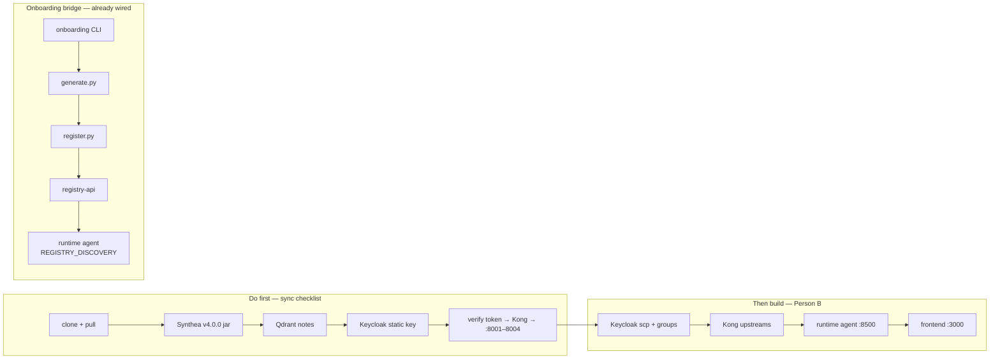

# Person B — Sync Checklist (do this BEFORE building agents / frontend)

> **Person A status (Jun 28, 2026):** Sprint **complete** — 4 MCP servers, Fixed Core, 62 tests,
> pushed to https://github.com/aakash-p-s/MCP-Data-Factory (`main` + `person-a/phase-2`).
> Person A keeps `docker compose up -d` + `bash scripts/start_mcp_servers.sh` running during
> your integration. Jul 9 = integrated demo; Person A on support only.

Person A pushed integration fixes + **four DB-backed MCP servers** (all live on :8001–8004).
Sync first or you'll build against stale state. Companion docs: [`HANDOVER_PERSON_B.md`](HANDOVER_PERSON_B.md) (contract),
[`PERSON_B_FRONTEND.md`](PERSON_B_FRONTEND.md) (chat + dashboard + anomaly panel),
[`ONBOARDING_RUNTIME_BRIDGE.md`](ONBOARDING_RUNTIME_BRIDGE.md) (onboarding → runtime bridge),
[`CHANGELOG.md`](CHANGELOG.md) (what changed + commands), [`IMPLEMENTATION.md`](IMPLEMENTATION.md) (setup).

Tick these top-to-bottom. Items marked **⚠ action** need you to actually do something.



## 0. Clone / pull Person A delivery
```bash
git clone https://github.com/aakash-p-s/MCP-Data-Factory.git
cd MCP-Data-Factory
git checkout main    # or person-a/phase-2 — same Person A code after Jun 28 merge
cp .env.example .env
```

## 1. Pull the latest
```bash
git checkout person-a/phase-2   # or main
git pull
```

## 2. ⚠ Re-download Synthea (determinism pin)
The jar source changed from the moving `master-branch-latest` to the pinned **`v4.0.0`**,
so everyone generates the *same* patients. Your old jar = different patients.
```bash
rm -f infra/synthea/synthea-with-dependencies.jar
curl -sL -o infra/synthea/synthea-with-dependencies.jar \
  https://github.com/synthetichealth/synthea/releases/download/v4.0.0/synthea-with-dependencies.jar
set -a; . ./.env; set +a
uv run python infra/synthea/load_patients.py
```
- **31 patients**, `demo-patient-1` is **`080b069b-5108-46b6-ecef-6aacd3b9ef3f`**.
- MCP tools query by **UUID** — resolve aliases from [`infra/synthea/demo_patient_aliases.json`](../infra/synthea/demo_patient_aliases.json) in the agent layer.

## 2b. ⚠ Clinical notes in Qdrant (if `get_recent_notes` returns empty)
```bash
LOAD_NOTES=true uv run python -c "
from pathlib import Path
from infra.synthea.load_patients import embed_and_load_notes
embed_and_load_notes(Path('infra/synthea/output/fhir'))
"
```
Or full loader: `LOAD_NOTES=true uv run python infra/synthea/load_patients.py` (truncates SQL).

## 3. ⚠ Seed interaction rules (if Postgres volume predates Jun 30)
Six curated RxNorm drug-interaction pairs are auto-loaded on **first** Postgres init via
`infra/postgres/seed-interaction-rules.sql`. If your `postgres-clinical` volume already existed,
apply manually or reset the volume:
```bash
docker exec -i postgres-clinical psql -U postgres -d clinical \
  < infra/postgres/seed-interaction-rules.sql
# or: docker compose -f docker-compose.data.yml down -v && up -d  (then re-run loader)
```

## 4. ⚠ Re-init the platform stack (static Keycloak key)
The realm now pins a **static RSA signing key** so Kong stops throwing `Invalid signature`.
Clear the old Keycloak volume once so it re-imports the realm with the static key:
```bash
docker compose -f docker-compose.platform.yml down
docker volume rm data_factory_keycloak_data    # name may differ; check `docker volume ls`
docker compose -f docker-compose.platform.yml up -d keycloak kong registry-db registry-api
```

## 5. Verify the green path works (token → Kong → servers)
Person A runs the data stores + servers; then:
```bash
docker compose -f docker-compose.data.yml up -d
uv run python backend/servers/vitals_trends/main.py              # :8001  DB-backed
uv run python backend/servers/labs_diagnoses/main.py             # :8002  DB-backed
uv run python backend/servers/medications_interactions/main.py   # :8003  DB-backed
uv run python backend/servers/clinical_notes_search/main.py      # :8004  Qdrant-backed

TOK=$(curl -s -X POST http://localhost:8080/realms/patient-risk/protocol/openid-connect/token \
  -d grant_type=client_credentials -d client_id=patient-risk-agent \
  -d client_secret=agent-secret-change-in-prod | python3 -c "import sys,json;print(json.load(sys.stdin)['access_token'])")

# vitals — expect 200
curl -s -o /dev/null -w "vitals %{http_code}\n" http://localhost:8000/mcp/clinical/vitals-trends/dev -X POST \
  -H "Authorization: Bearer $TOK" -H "Accept: application/json, text/event-stream" \
  -H "Content-Type: application/json" -d '{"jsonrpc":"2.0","id":1,"method":"tools/list"}'

# labs — expect 200
curl -s -o /dev/null -w "labs %{http_code}\n" http://localhost:8000/mcp/clinical/labs-diagnoses/dev -X POST \
  -H "Authorization: Bearer $TOK" -H "Accept: application/json, text/event-stream" \
  -H "Content-Type: application/json" -d '{"jsonrpc":"2.0","id":1,"method":"tools/list"}'

# meds — expect 200
curl -s -o /dev/null -w "meds %{http_code}\n" http://localhost:8000/mcp/clinical/medications-interactions/dev -X POST \
  -H "Authorization: Bearer $TOK" -H "Accept: application/json, text/event-stream" \
  -H "Content-Type: application/json" -d '{"jsonrpc":"2.0","id":1,"method":"tools/list"}'

# notes — expect 200 (requires Qdrant notes loaded)
curl -s -o /dev/null -w "notes %{http_code}\n" http://localhost:8000/mcp/clinical/clinical-notes-search/dev -X POST \
  -H "Authorization: Bearer $TOK" -H "Accept: application/json, text/event-stream" \
  -H "Content-Type: application/json" -d '{"jsonrpc":"2.0","id":1,"method":"tools/list"}'
# (was 401 Invalid signature before the Keycloak static-key fix)
```

## 6. ⚠ YOUR fix to do — Keycloak scope + group mapping
Person A's Fixed Core now **requires a Bearer token** by default (`AUTH_ALLOW_ANONYMOUS=false`).
Tokens must carry the correct **`scp`** and **`groups[]`** or calls get 401/403.

- Add Keycloak **protocol mappers / client scopes** so issued tokens include per-role scopes
  (`mcp.vitals.read`, `mcp.labs.read`, `mcp.meds.read`, `mcp.notes.read`) in a **`scp`** claim.
- Map realm roles to **`groups[]`** (`grp-clinical-viewer`, `grp-physician`, `grp-case-manager`).
- Flip `AUTH_VERIFY_SIGNATURE=true` in `.env` once mappers are live.
- Provide Person A **3 test tokens (one per role)** for RBAC matrix tests.

## 7. Know what's live vs stubbed on Person A's side
| Server | State | Port |
| --- | --- | --- |
| `vitals_trends` | **DB-backed (live)** | 8001 |
| `labs_diagnoses` | **DB-backed (live)** | 8002 |
| `medications_interactions` | **DB-backed (live)** | 8003 |
| `clinical_notes_search` | **DB-backed (live)** | 8004 |

All four MCP servers are live. Register all 4 in `registry-db`.

## 8. Contract — do NOT change without same-day notice (§6, see HANDOVER)
- Token claims: `sub`, `oid`, `groups[]`, `scp` (space-separated)
- vitals: tools `get_vitals_trend / compute_news2_score / list_abnormal_vitals`, scope `mcp.vitals.read`, route `/mcp/clinical/vitals-trends/dev`
- labs: tools `get_lab_trend / get_active_diagnoses / get_diagnosis_history`, scope `mcp.labs.read`, route `/mcp/clinical/labs-diagnoses/dev`
- meds: tools `get_active_medications / check_drug_interactions / get_polypharmacy_risk`, scope `mcp.meds.read`, route `/mcp/clinical/medications-interactions/dev`
- notes: tools `semantic_search_notes / get_recent_notes / get_notes_by_type`, scope `mcp.notes.read`, route `/mcp/clinical/clinical-notes-search/dev`
- Success → FHIR R4 resources per domain; denial → `403 {"error":{"code":"forbidden","reason":"..."}}`
- Pin the `mcp` SDK to match [`requirements.lock`](../requirements.lock) (`mcp==1.28.0`)

---

## Then start YOUR build tasks (Person B PRD / tracker)

Person A is done — your work starts here:

- [ ] **Keycloak** — `scp` + `groups[]` mappers; flip `AUTH_VERIFY_SIGNATURE=true`
- [ ] **Kong** — verify all 4 routes → `host.docker.internal:8001–8004`
- [ ] **Runtime agent** — LangGraph + 4 MCP clients via Kong URLs (`:8500`)
- [ ] **Frontend** — Next.js + CopilotKit + NextAuth (`:3000`) — see [`PERSON_B_FRONTEND.md`](PERSON_B_FRONTEND.md)
- [ ] **Jul 3** — CopilotKit chat + OTel/Jaeger; CHECKPOINT
- [x] **Jul 8** — unified `docker-compose.yml` (Person A merged)
- [ ] **Jul 9** — integrated live demo (Person A keeps MCP servers up)
